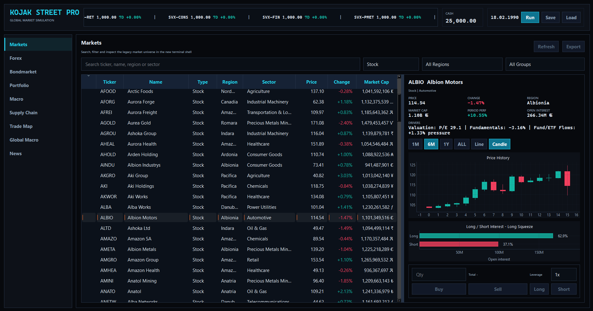
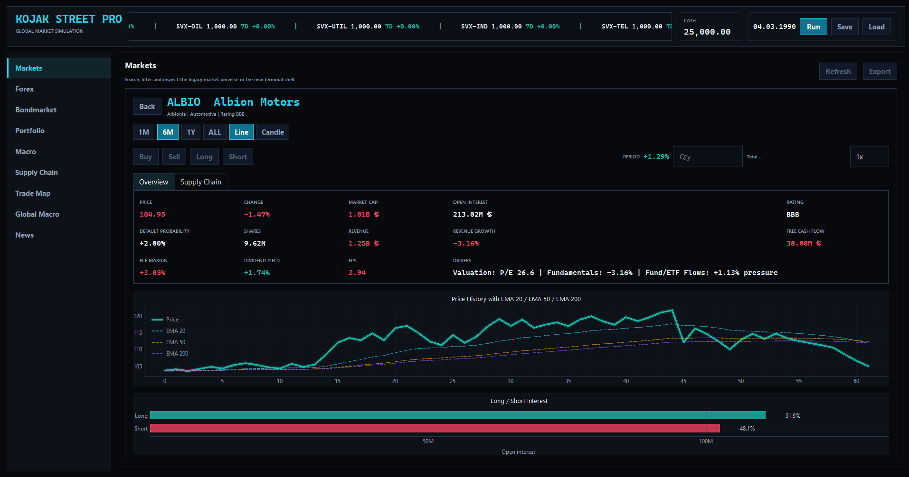
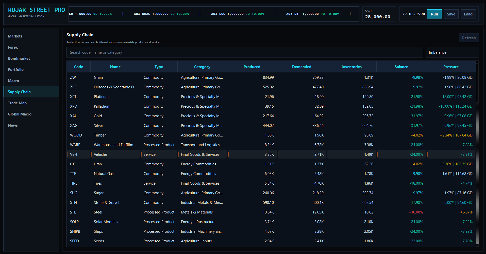
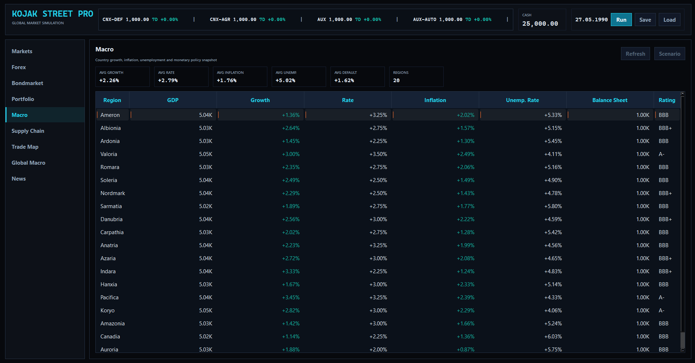
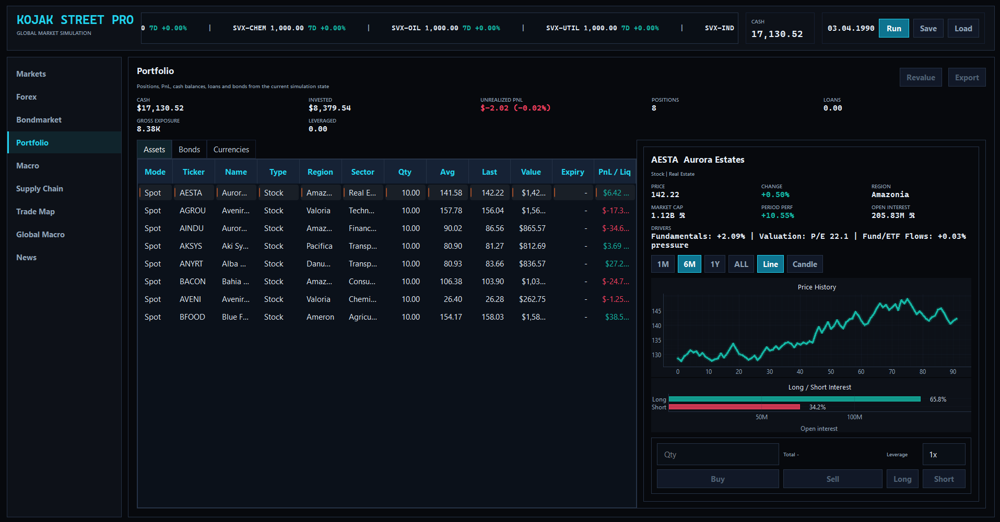
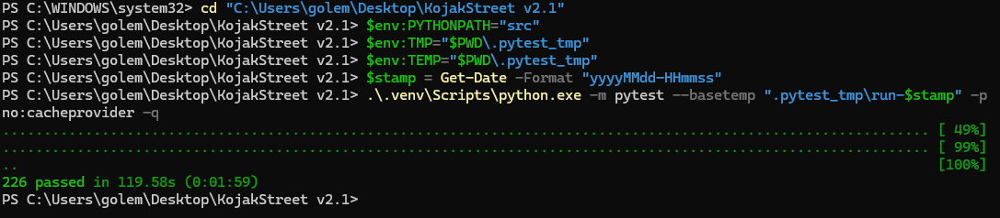

# Kojak Street Financial Simulation

Author: Özay Kocak

Kojak Street is a desktop financial-market simulation and analytics terminal.
It combines macroeconomic scenarios, supply-chain mechanics, company
fundamentals, commodities, bonds, funds, derivatives, portfolio risk and a
broker-style PySide6 user interface.

The project started as a simple trading game and grew into a broader economic
simulation lab: a place to explore how macro events, real-economy bottlenecks,
market psychology, credit risk and hedging instruments can interact inside one
running system.

## Project Purpose

This repository is a portfolio project for LLM-assisted financial engineering.
It demonstrates how a finance domain expert can use modern AI coding tools to
design, implement, test and critically document a complex simulation system.

The goal is not to provide investment advice or a production-grade pricing
library. The goal is to show applied system design:

- translating financial intuition into executable models
- connecting market, macro, credit and supply-chain logic
- building a usable desktop interface around the model
- validating behavior with automated tests
- documenting assumptions and limitations transparently

## Personal Background

Kojak Street was built by Özay Kocak, a trained banker with long-standing
interest in economics, politics, history, financial markets, macroeconomics and
monetary systems.

The project was developed autodidactically from scratch, without a formal
computer-science degree. The development process combined self-study,
feedback from software-engineering friends, many iterations, and extensive use
of LLMs as coding and architecture assistants. The product direction,
financial concepts and feature ideas were driven by Özay Kocak.

Recommended GitHub repository name:

```text
kojak-street-financial-simulation
```

## Current Capabilities

- Multi-asset market simulation: equities, commodities, crypto assets, indices,
  funds, ETFs, bonds, FX and derivatives
- Supply-chain model with raw commodities, processed products, regional
  supply/demand, shortages, inventories and trade flows
- Company fundamentals: revenue, free cash flow, EPS, ratings, capacity,
  input availability and sector exposure
- Financial products: commodity futures, FX forwards, yield futures, inflation
  swaps, freight futures, input-cost spreads, commodity spreads, options and CDS
- Portfolio mechanics: spot positions, futures, bonds, FX balances, loans,
  realized PnL, liquidation and settlement logic
- Risk and transparency views: market drivers, exposure, bond details,
  derivative use cases and performance metrics
- Versioned savegame migration and a growing service-based architecture
- Automated test suite covering core mechanics, UI behavior, performance
  budgets and persistence

## Technology

- Python
- PySide6 / Qt
- pyqtgraph
- DuckDB
- pytest
- Ruff

## Running The App

Install dependencies:

```powershell
python -m pip install -e ".[dev]"
```

Start the modern Qt app:

```powershell
python kojakstreet_qt_launcher.py
```

Run tests:

```powershell
$env:PYTHONPATH="src"
$env:TMP="$PWD\.pytest_tmp"
$env:TEMP="$PWD\.pytest_tmp"
$stamp = Get-Date -Format "yyyyMMdd-HHmmss"
.\.venv\Scripts\python.exe -m pytest --basetemp ".pytest_tmp\run-$stamp" -p no:cacheprovider -q
```

Latest local verification:

```text
226 passed in 104.19s
```

## Screenshots

### Market Terminal



### Model And Portfolio Views

| Asset detail | Supply chain |
| --- | --- |
|  |  |

| Macro dashboard | Portfolio |
| --- | --- |
|  |  |

### Verification



## Documentation

- [Model Assumptions](docs/model_assumptions.md)
- [Demo Scenarios](docs/demo_scenarios.md)
- [Screenshot Guide](docs/screenshot_guide.md)
- [Architecture](docs/architecture.md)
- [Career Positioning](docs/career_positioning.md)
- [Migration Plan](docs/migration-plan.md)

## Demo Path

A recommended review path is documented in
[docs/demo_scenarios.md](docs/demo_scenarios.md). It covers macro transmission,
supply-chain bottlenecks, credit and bond markets, derivatives, portfolio risk
and long-run stability.

Screenshots for the README and applications should follow
[docs/screenshot_guide.md](docs/screenshot_guide.md).

## Limitations

Kojak Street is a simulation and learning project. It uses simplified pricing
models, fictional countries, generated market data and intentionally compact
approximations. It is not suitable for real trading, portfolio management,
investment recommendations, regulatory reporting or professional model
validation.

Its value is in the integrated system: how financial concepts are structured,
connected, tested, visualized and improved iteratively.
