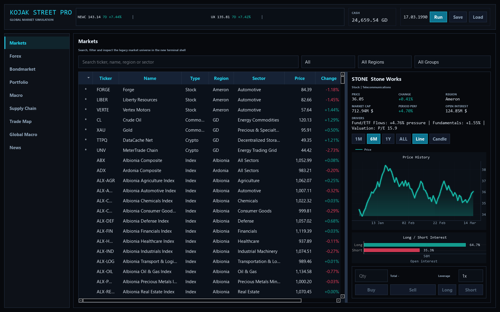
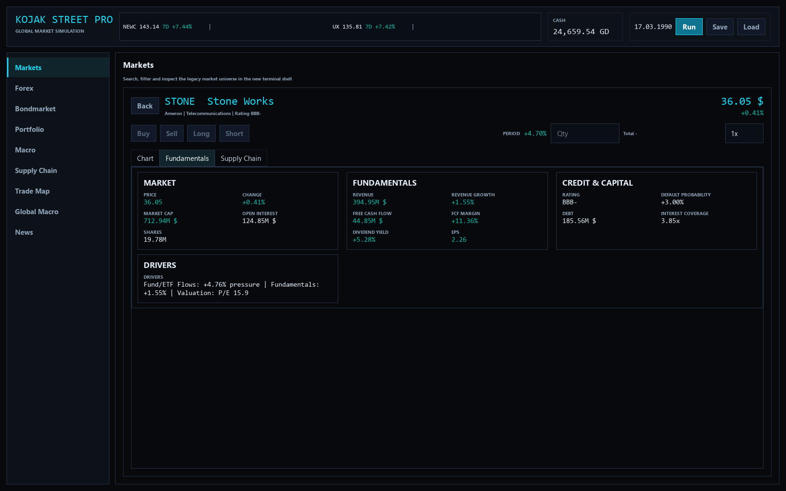
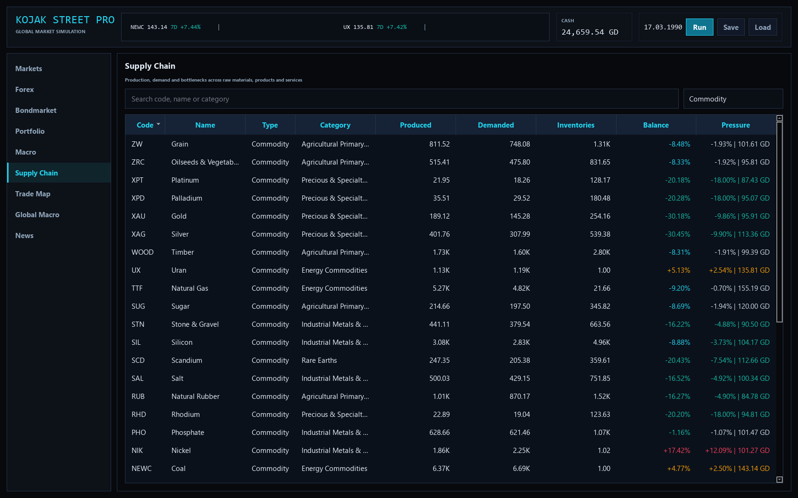
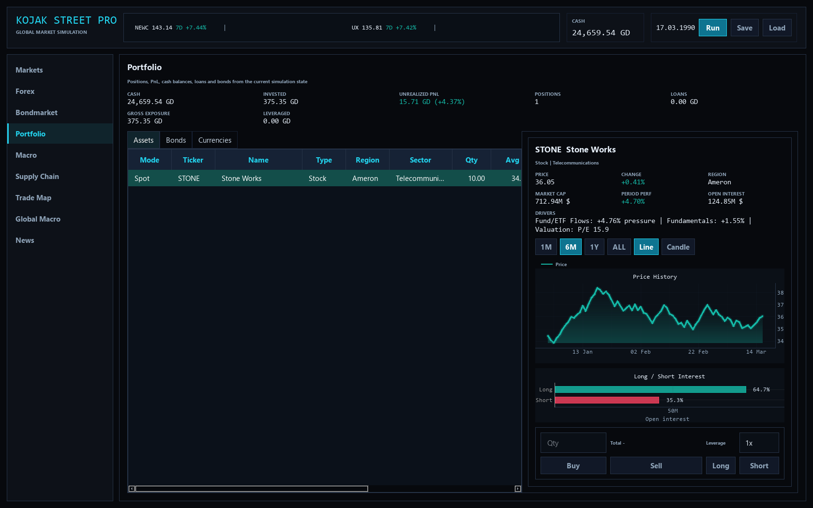
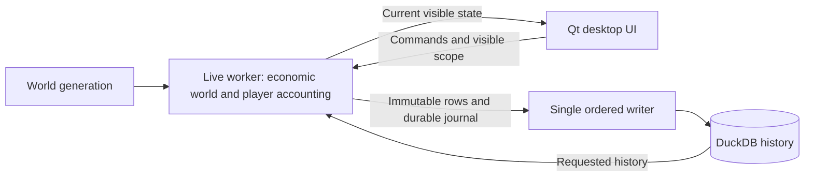

# Kojak Street

A working desktop simulation for exploring how economies, companies and financial markets interact—and managing a trading portfolio inside that fictional world.



## What is Kojak Street?

Kojak Street combines a financial terminal with an evolving economic world. Follow a country's inflation and interest rates, inspect a company's fundamentals and supply chain, compare financial instruments, and see how your positions develop over time. The application generates its own countries, companies, prices and events; it uses no live market feed.

The initial world contains **20 countries, 16 sectors and 1,280 companies**, plus **34 raw resources and 90 products/services**. Markets include equities, country and sector indices, funds/ETFs, FX, government and corporate bonds, crypto assets and derivatives. These are starting-world counts; companies and instruments can change during play.

**Status: Feature Complete / Feature Freeze for the current portfolio scope.** The supported application is the Python/Qt desktop version. Start with the [installation instructions](#installation-and-first-run), or read the [case study](docs/project_background.md) for the development journey.

## Why I built it

I am Özay Kocak, a trained banker with experience in customer service and financial advisory work. During a career break and personal learning period, I wanted to turn my interest in economics, politics and financial markets into something people could explore.

The first idea was a small stock-market game. It grew through requirements-driven iteration into a broader simulation and a practical learning project in software and product development. AI-assisted tools supported planning, implementation, debugging and testing. I remained responsible for the product direction, economic concepts, requirements, hypotheses, validation and trade-offs. The [case study](docs/project_background.md) explains that work with concrete examples.

## What you can explore

| Area | In the application |
| --- | --- |
| Countries and macroeconomics | Growth, inflation, rates, unemployment, fiscal and monetary conditions, credit ratings, expectations and market psychology |
| Companies and production | Revenue, free cash flow, debt, distress, production recipes, inventories, shortages and regional trade |
| Markets and credit | Equities, indices, fund flows, FX, sovereign/corporate bonds, options, futures, forwards, swaps and CDS |
| Portfolio | Spot and leveraged long/short positions, FX balances, valuation, PnL, margin, liquidation and settlement |
| Society | Population, birth/death rates and realized growth; Basic, Skilled and Highly Qualified workforce supply, company demand and coverage |
| Politics V1 | Seven government systems, parties, competitive elections where applicable, government/coalition formation, descriptive economic/social ideology axes and political stability |
| History | Price charts, country/product analytics, structural events, checkpoints and persistent economic history |

Workforce shortages have a bounded **monthly** company effect. Headline unemployment remains a separate macroeconomic measure; workforce coverage is not an unemployment rate. Politics uses monthly and event-based updates with sparse history. Its proposed government-bond risk premium is **disabled** because the historical bond/curve/fund/derivative consistency gate was not satisfied.

The player is a **retail investor**: ordinary trades and holdings do not move the world economy or global prices. Portfolio accounting, payouts, margin and settlement remain active. Simulated institutional fund flows still belong to the world's price formation.

## Three starting worlds

The chooser labels are **GENESIS WORLD**, **HETEROGENEOUS WORLD** and **ESTABLISHED WORLD**.

| Mode | Starting experience |
| --- | --- |
| Genesis | A common, symmetric macro and company-size baseline on Day 1. Individual company attributes and subsequent outcomes still vary. |
| Heterogeneous | Controlled country population/GDP/productivity and company-size diversity on Day 1. Initial global budgets are preserved; no pre-simulation history is invented. |
| Established | 50, 75 or 100 years of generated historical development before the player enters. A coarse yearly/monthly historical model is followed by **365 real daily simulation steps** as burn-in. |

Established is a hybrid historical generator, not decades of the full daily production engine. It runs in a separate process and produces a verified world bundle. Generation can be cancelled and restarted; partial-generation resume is outside the current scope.

## Selected product views

All six documentation images come from the current application: Heterogeneous World, seed 1729, after 75 actual daily steps, on **17 March 1990**. The portfolio contains a real small spot purchase. The politics image correctly labels the initial mandate allocation; no election has yet occurred in that country.

| Company fundamentals | Country history |
| --- | --- |
|  |  |


| Production and supply chains | Portfolio and exposure |
| --- | --- |
|  |  |

## How it works

Python implements the economic model; PySide6 and pyqtgraph provide the desktop interface; DuckDB stores analytical history. Normal startup gives a separate live process ownership of one mutable world. The interface receives global status, current rows for its active view and details requested for the selected entity or tab. It requests deeper chart history separately.



Economic, initialization and player-specific random streams have explicit boundaries. Workforce and politics add monthly/event state without restoring a daily mirror of every hidden view. **Speculative next-day precomputation is not enabled**: its isolated prototype failed the sustained cost/readiness test. See [architecture](docs/architecture.md) for modules and boundaries.

## Performance engineering

Visible stutter led to measurement of the whole transition, including state preparation, history, transfer, rendering and persistence. Broad synchronization was doing substantial work for data the player was not viewing. On-demand projection, bounded chart updates, cached lookups and a durable ordered writer addressed those measured costs.

One matched **native Windows, mature-world** on-demand comparison reduced ordinary-day transition median from **2,271 ms to 445 ms**; the after series contained 37 ordinary days. A later matched native pass measured **398 ms to 291 ms** across its own 37 ordinary-day samples. These are separate experiments, not one combined speedup.

The latest Politics control used **headless runtime execution with persistence active** over 90 consecutive days: ordinary-day median was approximately **161 ms**, the monthly politics phase **0.263 ms**, and one election phase **0.403 ms**. These measure different boundaries from native GUI latency. Report days, flushes, cold navigation, Save/Load and backpressure can take longer. Computation time is also separate from the intentionally visible in-game day duration.

The [case study](docs/project_background.md#challenge-2-investigating-visible-stutter) includes the progression, failed approaches and measurement conditions; [dated engineering reports](docs/portfolio-closeout-2026-10-08.md#evidence-and-historical-reports) retain the detailed evidence.

## Reliability and saves

The final implementation verified **732 test cases**: 731 passed in the full run; one stale four-tab expectation was corrected to the intended five-tab contract, and all 12 tests in that module then passed. Production code and the other tests were unchanged. This is an aggregate verified result, not a claim of a second clean full-suite run.

Validation includes seeded replay, exact world/RNG comparisons, 365-day runs, 5/20/50-year coarse-history checks with 365-day burn-in, multi-seed checks, Save/Load continuation, UI navigation, journal replay and actual subprocess crash probes. [Current verification and its limits](docs/portfolio-closeout-2026-10-08.md) distinguish these checks from historical counts and remote CI.

The live writer journals a materialized batch durably before publishing it, then commits it through the single DuckDB owner. Save, Load, history queries and shutdown use ordered barriers. A bounded queue applies backpressure; durability is not replaced by an in-memory queue.

Current **V9 checkpoints** preserve required bounded computational history and RNG state. Checkpoint and matching DuckDB history belong together: the save is not a backup of the whole analytical archive. Compatible older saves have explicit migration paths, but data omitted by an older writer cannot be reconstructed. Reproducibility requires the same model and compatible dependency versions. See [model assumptions and save semantics](docs/model_assumptions.md).

## Installation and first run

Use **Python 3.11 or 3.12** with a graphical desktop. The package requires Python >=3.11; local release checks use **Windows and Python 3.12.14**. The CI workflow targets Windows/Linux on 3.11/3.12; workflow configuration alone does not establish a passing run. Linux also needs Qt's system libraries.

From a checkout, in Windows PowerShell:

```powershell
python -m venv .venv
.\.venv\Scripts\python.exe -m pip install --upgrade pip setuptools wheel
.\.venv\Scripts\python.exe -m pip install -e ".[dev]"
.\.venv\Scripts\python.exe kojakstreet_qt_launcher.py
```

Alternatively launch the installed entry point: `.\.venv\Scripts\kojakstreet-qt.exe`. On Linux, use `.venv/bin/python` and `.venv/bin/kojakstreet-qt`.

Choose Genesis World, seed 1729, for a common starting baseline; choose Heterogeneous for immediate size diversity. Run through the first monthly report on the 15th, pause, open a company detail and place a small spot trade. Explore Macro → country → Society & Politics, Supply Chain and Portfolio. Dense tables may require scrolling on smaller displays. [Demo scenarios](docs/demo_scenarios.md) provide a short guided tour.

Source and Python wheel are the supported delivery paths. The experimental frozen Windows executable is **not release-approved**; its earlier startup smoke did not finish.

To build and install a wheel in another environment:

```powershell
.\.venv\Scripts\python.exe -m pip wheel . --no-deps --wheel-dir dist
python -m venv .venv-wheel
.\.venv-wheel\Scripts\python.exe -m pip install dist/kojakstreet-0.2.0-py3-none-any.whl
.\.venv-wheel\Scripts\kojakstreet-qt.exe
```

Dependencies include NumPy, DuckDB, PySide6 and pyqtgraph. [requirements-tested-py312.txt](requirements-tested-py312.txt) records tested direct versions, not a complete cross-platform lockfile. The application uses a local data directory; set `KOJAKSTREET_DATA_DIR` to isolate a demo or test.

Useful checks from a development installation:

```powershell
.\.venv\Scripts\python.exe -m pytest -q
.\.venv\Scripts\python.exe -m compileall -q src tests tools
.\.venv\Scripts\python.exe tools/wheel_smoke.py
.\.venv\Scripts\python.exe tools/source_smoke.py --output .cache/source-smoke.json
```

The source smoke exercises the real chooser/live-worker path, trading, a monthly report, Save/Load continuation and shutdown. The wheel smoke checks installed imports outside the checkout. See the [CI workflow](.github/workflows/ci.yml).

## Scope and limitations

This is a synthetic learning and portfolio project. Internal consistency is not evidence of empirical forecasting or calibrated pricing accuracy. It is unsuitable for real investment decisions or regulatory use. Transaction fees, taxes and slippage are excluded; derivative and credit models are deliberately simplified.

Workforce uses aggregate equivalents rather than individual people, wage bargaining, migration or education cohorts. Politics V1 is descriptive and event-based; it is not a political grand-strategy game. A separate housing/real-estate market is outside the completed scope, although real-estate companies are part of the equity sectors. Precomputation and the political bond premium remain disabled for the reasons documented above.

Feature freeze defines the delivered portfolio scope; it does not rule out future development. `src/kojakstreet` contains the supported application; `daten.py` and `speicher.py` remain active compatibility modules. The old root-level Tkinter application is not the supported entry point.

**Author:** Özay Kocak · Banking, business analysis and self-directed product/software learning. Built through domain knowledge, AI-assisted implementation, measurement and iterative validation.

Read the [case study](docs/project_background.md), [architecture](docs/architecture.md) and [model assumptions](docs/model_assumptions.md). Released under the [MIT License](LICENSE).
