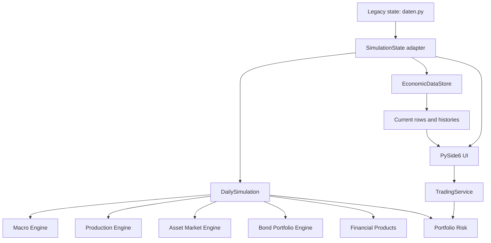
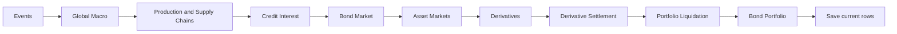

# Architecture

Kojak Street is transitioning from an early prototype with legacy root modules
into a package-based architecture under `src/kojakstreet`.

The current architecture preserves the old application while building a modern
Qt runtime around shared core logic.



## Simulation Flow



## Core Modules

- `core/simulation.py`: daily simulation orchestration
- `core/market_calculations.py`: asset price updates
- `core/production_chains.py`: commodities, processed products and trade flows
- `core/company_lifecycle.py`: company fundamentals, ratings and hedging
- `core/financial_products.py`: derivative universe and pricing rules
- `core/trading.py`: portfolio trading mutations
- `core/trade_preview.py`: non-mutating trade validation and previews
- `core/accounting.py`: portfolio value and currency conversion
- `core/save_migrations.py`: explicit savegame migration pipeline
- `core/market_data_service.py`: central market-data lookup interface
- `core/data_store.py`: DuckDB-backed current rows and histories

## UI Modules

- `ui_qt/app.py`: main application shell and runtime orchestration
- `ui_qt/views/markets_view.py`: market universe, filters and asset details
- `ui_qt/views/portfolio_view.py`: positions, bonds, futures, FX and exposure
- `ui_qt/views/supply_chain_view.py`: product flows and regional trade
- `ui_qt/views/macro_view.py`: country-level macro dashboard
- `ui_qt/widgets/stock_detail_dialog.py`: detailed asset inspection
- `ui_qt/widgets/asset_chart_panel.py`: quote, chart and order ticket

## Engineering Principles

- Preserve the legacy app while migrating vertical slices.
- Move business rules into `core` before exposing them in the UI.
- Prefer deterministic, testable helpers for pricing and accounting behavior.
- Keep trade validation non-mutating and separate from trade execution.
- Store model assumptions explicitly instead of hiding simplifications.
- Use performance budgets to keep the app responsive.

## Current Verification

The project includes tests for:

- financial products and derivative settlement
- trading validation
- bonds and portfolio valuation
- supply chains and production signals
- market behavior and volatility
- savegame migration
- Qt view behavior
- runtime integration
- performance budgets

Recent local verification:

```text
219 passed
```
