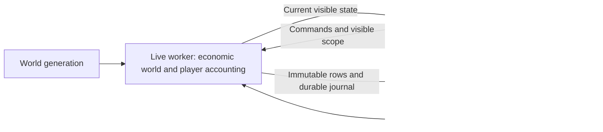

# Architecture

The supported application is the package-based Python/Qt desktop runtime. Root modules `daten.py` and `speicher.py` remain active compatibility boundaries; the older Tkinter entry point is not the supported release path.

Normal startup opens the world chooser through `kojakstreet_qt_launcher.py` or the installed `kojakstreet-qt` command. A bootstrap runtime initializes the chosen world, then `LiveSimulationProcess` hands its checkpoint/history to `live_worker.py`. The live process owns one authoritative mutable world. Qt owns projections, table models and bounded chart caches.

## Ownership and data flow

The normal day path computes the world's daily phases and player consequences in order. It publishes globally visible status, active-view current rows and selected entity/tab details through explicit scopes. Hidden views are not maintained as a full mirrored world. Opening a view or detail requests its current scope; deeper history uses a separate asynchronous request path.

The full snapshot/delta utilities remain available for explicit diagnostic/compatibility purposes. Their presence does not mean normal ticks recursively synchronize the complete public world. Recent computational lookbacks stay in the authoritative world; Qt charts retain existing series while new history arrives and reject obsolete responses.

## Economic and player boundaries

`core/simulation.py` orchestrates events, macroeconomics, production, credit, markets, derivatives and accounting. World preparation and ordered player commit preserve daily booking and settlement semantics.

Ordinary player trades/holdings have retail-investor semantics: they do not enter global open interest, crypto universe survival or world RNG decisions. Player accounting retains cash conversion, interest, coupons/dividends, PnL, margin, liquidation and settlement. Simulated institutional fund flows remain economic inputs.

Workforce is aggregated and applied monthly. Population uses explicit annual rates and elapsed-period conversion. Politics updates monthly and on events with country-local deterministic streams. Its ideology axes are descriptive; `PREMIUM_ENABLED = False` keeps the proposed sovereign-bond premium inactive.

There is no live speculative N+1 world. Full/partial precomputation was rejected after the copied-world readiness/cost experiment. UI continuity does not depend on speculation.

## World generation and randomness

- **Genesis:** common Day-1 macro/company-size roots and the regular bootstrap.
- **Heterogeneous:** one-time controlled population, GDP/productivity and company-capitalization roots, preserving initial global budgets. Existing formulas derive subsequent books; no fake prehistory or recurring diversity generator is introduced.
- **Established:** the UI offers 50/75/100 years. Fast History V3 uses coarse historical steps, rebaseline and 365 ordinary daily burn-in steps in an isolated generator process. This is not a full daily simulation of the entire historical interval.

Seed-derived initialization, workforce/politics and player RNG boundaries avoid unintended consumption of the daily economic stream. Checkpoints retain Python/NumPy state. Exact continuation is version-dependent, not a promise across arbitrary model or dependency upgrades.

## Persistence and recovery

The live worker enables a single ordered background DuckDB owner. Direct integrated runtimes default to synchronous persistence unless explicitly configured otherwise.

Rows are materialized before submission; the writer receives immutable values rather than live world references. Publication follows a length/checksum/history-identity/sequence-validated, fsynced journal. DuckDB transactions commit before a durable acknowledgement. Recovery replays unacknowledged batches idempotently.

Two reusable journal slots and at most two outstanding batches bound work in flight; the task queue has capacity three. Batches above the 64 MiB limit use the synchronous fallback. Another submission waits under backpressure. Writer failures are latched and exposed, not silently ignored.

Save, Load, history reads and shutdown use ordered barriers. V9 checkpoints preserve bounded computational state and RNG, with explicit readers/migrations for supported older formats. Numerical nested state is preserved; reference caches are rebuilt. Display-only regional/company input-output histories keep two checkpoint samples, while analytical history remains in the matching DuckDB store.

A checkpoint and its matching history identity belong together. Loading discards the abandoned timeline rather than attaching an unrelated store. The archive is not embedded in the checkpoint. Raw detail is retained for 730 days, semantic monthly aggregates for 20 years and yearly aggregates permanently; structural events have their own permanent ledger. Rates, levels, flows and prices use different aggregation semantics.

## Module map

| Responsibility | Main modules under `src/kojakstreet` |
| --- | --- |
| Runtime ownership and transport | `adapters/legacy_runtime.py`, `live_process.py`, `live_worker.py` |
| Visible state and current rows | `visible_state.py`, `core/market_data_service.py` |
| Economic phases | `core/simulation.py`, `core/production_chains.py`, `core/market_calculations.py`, `core/company_lifecycle.py` |
| Credit and financial products | `core/bond_calculations.py`, `core/funds.py`, `core/financial_products.py` |
| Retail accounting/trading | `core/player_accounting.py`, `core/accounting.py`, `core/trading.py`, `core/trade_preview.py` |
| Society and politics | `core/workforce.py`, `core/politics.py` |
| Starting worlds | `world_generator.py`, `core/established_world.py`, `core/fast_history.py`, `core/heterogeneous_start.py` |
| Checkpoints and history | `core/checkpoints.py`, `core/save_migrations.py`, `core/history.py`, `core/data_store.py`, `core/persistence_writer.py` |
| Desktop interface | `ui_qt/app.py`, `ui_qt/views/`, `ui_qt/widgets/`, `ui_qt/models/` |

## Validation boundaries

Small behavioral tests, real live-process UI checks, exact economics/RNG comparisons, long generation runs and subprocess crash probes serve different purposes. Timing diagnostics and independently generated history IDs are not economic fields. Native parallel SQL yearly averages have a documented least-significant-bit ordering limitation; controlled single-thread checks establish exact aggregate equality.

See the [current verification record](portfolio-closeout-2026-10-08.md), [case study](project_background.md) and [model assumptions](model_assumptions.md). The [September release report](release-readiness-2026-09-28.md) is historical evidence for its own source revision.
