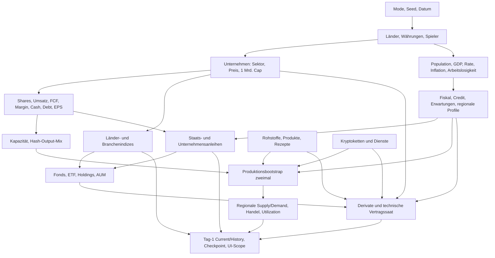

# Genesis-Audit und Reparatur der Länderindizes

> Dated engineering evidence for the revision described below. Test counts,
> model versions and measurements are historical unless explicitly carried
> into the [current verification record](portfolio-closeout-2026-10-08.md).
> Raw cache artifacts remain local; source links identify modules, not the
> original audit line numbers.

Stand: 2026-10-07. Untersucht wurde der aktuelle, bereits optimierte Produktionsstand; die vorhandenen lokalen Änderungen wurden vor diesem Auftrag separat eingefroren. **Kein heterogener Startmodus und keine neuen Wertebereiche wurden implementiert.**

Alle 20 breiten Länderindizes existieren in der Welt. Der bestätigte Anzeigefehler entsteht durch Kürzelkollisionen: die Marktdatenliste ersetzt Indexzeilen durch gleichnamige Aktien. Zusätzlich bleiben einzelne Constituent-Kürzel nach der zweiten Aktieninitialisierung veraltet. Beide Fehler wurden an ihren Ursachen behoben, ohne Indexformeln oder Aktienerzeugung zu ändern.

## 1. Erzeugungspfad bis zum spielbaren Tag 1

`NewSimulationDialog.config()` (`ui_qt/new_simulation.py:94`) erzeugt GENESIS/Seed/0 Jahre. `IntegratedRuntime.__init__` (`adapters/legacy_runtime.py:52`) setzt Python- und NumPy-Seed, leert alte dynamische Attribute von `daten` und lädt das Modul neu. Die Engine-Imports können `daten` vorher laden; die explizite Neuladung nach dem Seed ist der maßgebliche Erzeugungslauf. Kalter Lauf, Wiederholung und vorher geladener Modulzustand lieferten bei Seed 2307 identische Startcheckpoints.

`daten.py`: Länder/Währungen und Spieler → 1.280 Unternehmen → 34 Rohstoffe → 90 verarbeitete Produkte/Dienstleistungen → 32 Kryptoketten → 340 Indizes → Ländermakro/Bevölkerung/Fiskal/Erwartungen → 420 gerichtete FX-Historien → Makro-/Portfolio-/GLI-Startpunkte → globale Startwerte → Fonds (mit Anleihenbootstrap) → Derivate → Labelcodes/Regime → Leeren aller Asset-Preishistorien → Produktionsbootstrap ohne Bevölkerungswachstum.

Danach Runtime-Fassade/Engines → Fiskal/Erwartungen erneut (setdefault) → Unternehmensuniversum erneut, Produkte/Population/Regionalprofile/Spezialisierungen → Fundamental-/Psychologieprüfungen → Produktionsbootstrap erneut → Hedge-Caches/Regime/Markt-Indizes vorwärmen → globale Historiensicherung → dynamischer Anleihenmarkt → DuckDB/Repository/Trading/Context → vollständige Tag-1-Aufzeichnung. `record_day` führt keine Simulationsperiode aus. Der Live-Worker aktiviert anschließend den bestehenden einzelnen Persistenz-Writer.

Der UI-Einstieg `ui_qt/app.py:793` routet GENESIS direkt zu IntegratedRuntime und anschließend zum Live-Worker; ein gespeichertes `world_generation`-Config wird im aktuellen GENESIS-Pfad nicht angelegt. ESTABLISHED nutzt `world_generator.generate`, im Standardpfad hybrid `fast_history_v2` plus täglichen Burn-in; `production_equivalent=True` nutzt vollständige Tageszyklen. Keine dieser Vorhistorien soll für den dritten Sofortstart übernommen werden.

Die aufgezeichnete erste Aufrufreihenfolge einschließlich Dateinamen und Zeilen steht in `.cache/genesis-audit/before-2307/creation-calls.json`. Sie ersetzt keine Abhängigkeitsanalyse: wiederholte Aufrufe sind absichtlich dedupliziert.

## 2. Abhängigkeitsgraph

## 3. Vollständiges Feldinventar

Das [separate Inventar](genesis-initialization-field-inventory-2026-10-07.md) enthält **931** Entity-/Weltfelder, verschachtelte Wirtschaftszustände und Modelldefinitionen in der vorgeschriebenen 14-spaltigen Tabelle. Keine Beschränkung auf die Beispielsammlung des Auftrags. Private Output-/Psychologie-/Hedge-Frühzustände sind enthalten. Die exakten Einzelwerte und vollständigen Schreib-/Lesestellen stehen außerdem in `.cache/genesis-audit/field-inventory.json`.

## 4. Einordnung der Startgrößen

Direkt steuerbare wirtschaftliche Größen werden als ROOT ausgewiesen, auch wenn heute alle Länder denselben Wert erhalten. Bestehende Namens-/Preis-/Cash-/Debt-/Crypto-/AUM-Zufälle bleiben EXISTING_RANDOMIZED. Deklarierte Universen und Vertragskonventionen sind FIXED. Shares, Gewichte, Verschuldungsquoten, Umsatz/FCF/Dividenden, Anleihendurationen und Partnerflüsse sind DERIVED. Die zweimal berechnete Produktion, regionale Wirtschaft, Preisindizes und Kapazitätsentwicklung sind BOOTSTRAP_RESULT.

Semantisch problematische Direktzuweisungen: EPS wird aus Preis/zufälligem P/E gesät; Global-Balance-Sheets, Liquidität und lange Renditen werden nicht aus dem fertigen Ländermakro/Anleihenbuch initialisiert; viele Derivatpreise bleiben zunächst 100. Diese Punkte sind Auditbefunde und wurden nicht wirtschaftlich umgebaut.

## 5. Tatsächliche Werte und bestehende Bereiche

Jedes Land: Bevölkerung 20.000.000, GDP 5.000, annual growth 0,010, policy rate 0,035, CPI 0,010, unemployment 0,060, balance sheet 1.000, rating BBB. Debt=GDP×0,62=3.100; annual deficit=GDP×0,025=125; private credit=GDP×0,92=4.600; credit growth 0,018. Erwartungswerte kopieren Wachstum/CPI/Rate/Arbeitslosigkeit; Überraschungen beginnen bei 0. Regierungsschulden und GDP verwenden dieselbe abstrakte Modellskala; eine Umrechnung in Aktienwährungsbeträge ist nicht definiert.

Aktien: je 4 Firmen × 16 Branchen × 20 Länder. Initial cap=1.000.000.000 je Unternehmen. Preis=round(U[18,145],2); shares=cap/price; cap=price×shares; EPS=max(0,1, price/U[14,28]); Cash=cap×U[0,04,0,22]; Debt=cap×U[0,05,0,45]. Funding-Bonds können diese beiden letzten Werte noch im Bootstrap verändern. Rating aus {A-,BBB+,BBB,BBB-,BB+}. Long/short/open interest=2,0%/1,6%/3,6% der Cap. Kein Small/Mid/Large-Cap-Saatmodell; heute nur unterschiedliche Preise/Shares bei gleichem Firmenwert.

Crypto: 8 Ketten je STORE/PAY/DATA/GRID. Preis round(U[12,180],2), Kapazität U[360,920], Supply STORE U[5 Mio.,50 Mio.], andere U[18 Mio.,220 Mio.], Transaktionen U[35.000,260.000], Gebühren U[8.000,95.000], Wallets U[18.000,160.000]. Task-Demand 620/760/540/500 jeweils ÷8, Share 1/8, technische Auslastung zunächst 0,7. Cap verwendet den ungerundeten Preis×Supply, während Kurs gerundet ist: bestehende kleine Inkonsistenz, kein unabhängiger Heterogenitätsregler.

Fonds: Preis 100, AUM=max(27 Mio., target×U[0,35,0,95]); Mindest-AUM für den Fortbestand 18 Mio.; tatsächliche Gebührenquote **0**. Anleihenliquidität GOV U[0,75,1], CORP U[0,35,0,85]. Bestehende Produktionsbereiche sind unten vollständig angegeben. Gemessene Min/Median/Max pro Entity-Feld stehen im Inventar; sie werden nicht als theoretische Bereiche ausgegeben.

## 6. Budgets und Erhaltung

| Größe | Gemessener Gesamtwert | Aktuelle Semantik | Bei Umverteilung |
| --- | --- | --- | --- |
| Population | 400000000.0 | 20×20 Mio.; fester Saatgesamtwert, kein expliziter Generator-Budgetverteiler | 400 Mio. kontrolliert verteilen; Länderminimum beachten; globaler Haushaltsbedarf folgt Summe |
| GDP | 100000.0 | 20×5.000; nicht aus Population abgeleitet | gemeinsame Einheit/Invariante vor Änderung festlegen; Gewichte, Fiskal und FX hängen daran |
| Unternehmen | 1280 | 64/Land, 4 je Land/Sektor; Fill-Ziel 1280 | zunächst unverändert; sonst Produktdeckung und Lifecycle-Fill berücksichtigen |
| Firmen-Cap | 1280000000000.0 | 1.280×1 Mrd., bis auf Float-Arithmetik | natürliches Startbudget; Preis/Shares/Fundamentals gemeinsam ableiten |
| Shares | 20956956167.828693 | kein unabhängiges/global fixiertes Aktienzahlbudget | Shares=Cap/Preis; keine dritte unabhängige Ziehung |
| Company capacity | 377894.1699309955 | sektorabhängig aus Umsatz/Margin, dann Bootstrapwachstum | kein fester physischer Gesamtpool; nicht zusätzlich neben Größe randomisieren |
| Rohstoffe/Produkte/Dienste | 34+90 | feste Codes/Rezepte, Mengen aus Markthash und Bootstrap | regionale Mengen werden auf globale Supply/Demand normiert; kein endlicher geologischer Deposit-Pool |
| Fonds-AUM | 203434188562.38486 | abhängig von underlying Caps/Mandaten und Zufallsfaktor; kein fixer Weltpool | Investmentwerte überlappen Aktien/Bonds; nicht zum gleichen Welt-Cap-Budget addieren |
| Crypto-Cap | 326644631481.7021 | unabhängige Preis-/Supply-Ziehungen; kein fixes globales Budget | Task-Anzahl beibehalten; keine Gleichsetzung mit Aktienweltbudget |
| Anleihen | 1358 | 1350 base +8 funding in Seed 2307; nominal 100 ist Quote, kein aggregierter Schuldenbetrag | 64 Corporate-Basisbonds/Land plus bedarfsabhängig; Debt nicht aus Bond-Anzahl berechnen |
| Liquidity | M2=100000, RRP=7500, TGA=4500, GLI=15420 | teilweise direkte Saat und teilweise abgeleitete Größen; keine strikte Währungs-Geldmengenerhaltung | Netliquidität konsistent berechnen, historische Referenzen passend setzen |
| Trade | 1.9895196601282805e-13 | Exports/Imports paarweise; balance anschließend um Weltmittel bereinigt | Summe≈0 mit Floatrest; regionale Mengen und Ländergewichte normalisieren |
| Player | 25000 | GD Cash, sonst FX=0, Loans=0, leere Positionen | vollständig erhalten; keine Finanzierung der Welt durch Kleinanleger |

## 7. Gemessene Länder-Symmetrie

Seed 2307, vollständiger spielbarer Start. GDP/rates/population sind exakt gleich; Preise, Shares, Cash, Debt, Namen, regionale Supply/Demand/Handel und ausgewählte Fonds unterscheiden sich. Die branchenbezogenen Umsätze und Kapazitäten folgen zunächst denselben Profilen. Float-Min/Max der Cap im Roh-JSON sind vollständig erhalten.

| Land | Population | GDP | Firmen/Sektoren | Cap gesamt | Cap min/median/max | Capacity | GOV/CORP Bonds | Fonds | Index-Welt/UI vorher/UI nachher |
| --- | --- | --- | --- | --- | --- | --- | --- | --- | --- |
| Ameron | 20000000.0 | 5000.0 | 64/16 | 64000000000.0 | 999999999.9999999/1000000000.0/1000000000.0000001 | 18894.708496550 | 3/64 | 13 | 17/17/17 |
| Albionia | 20000000.0 | 5000.0 | 64/16 | 64000000000.0 | 999999999.9999999/1000000000.0/1000000000.0000001 | 18894.708496550 | 3/67 | 13 | 17/17/17 |
| Ardonia | 20000000.0 | 5000.0 | 64/16 | 64000000000.0 | 999999999.9999999/1000000000.0/1000000000.0000001 | 18894.708496550 | 3/65 | 13 | 17/17/17 |
| Valoria | 20000000.0 | 5000.0 | 64/16 | 64000000000.0 | 999999999.9999999/1000000000.0/1000000000.0000001 | 18894.708496550 | 3/65 | 13 | 17/17/17 |
| Romara | 20000000.0 | 5000.0 | 64/16 | 64000000000.0 | 999999999.9999999/1000000000.0/1000000000.0000001 | 18894.708496550 | 3/64 | 13 | 17/16/17 |
| Soleria | 20000000.0 | 5000.0 | 64/16 | 64000000000.0 | 999999999.9999999/1000000000.0/1000000000.0000001 | 18894.708496550 | 3/65 | 13 | 17/16/17 |
| Nordmark | 20000000.0 | 5000.0 | 64/16 | 64000000000.0 | 999999999.9999999/1000000000.0/1000000000.0000001 | 18894.708496550 | 3/65 | 13 | 17/16/17 |
| Sarmatia | 20000000.0 | 5000.0 | 64/16 | 64000000000.0 | 999999999.9999999/1000000000.0/1000000000.0000001 | 18894.708496550 | 3/64 | 13 | 17/17/17 |
| Danubria | 20000000.0 | 5000.0 | 64/16 | 64000000000.0 | 999999999.9999999/1000000000.0/1000000000.0000001 | 18894.708496550 | 3/65 | 13 | 17/17/17 |
| Carpathia | 20000000.0 | 5000.0 | 64/16 | 64000000000.0 | 999999999.9999999/1000000000.0/1000000000.0000001 | 18894.708496550 | 3/66 | 13 | 17/17/17 |
| Anatria | 20000000.0 | 5000.0 | 64/16 | 64000000000.0 | 999999999.9999999/1000000000.0/1000000000.0000001 | 18894.708496550 | 3/65 | 13 | 17/17/17 |
| Azaria | 20000000.0 | 5000.0 | 64/16 | 64000000000.0 | 999999999.9999999/1000000000.0/1000000000.0000001 | 18894.708496550 | 3/65 | 13 | 17/17/17 |
| Indara | 20000000.0 | 5000.0 | 64/16 | 64000000000.0 | 999999999.9999999/1000000000.0/1000000000.0000001 | 18894.708496550 | 3/64 | 13 | 17/17/17 |
| Hanxia | 20000000.0 | 5000.0 | 64/16 | 64000000000.0 | 999999999.9999999/1000000000.0/1000000000.0000001 | 18894.708496550 | 3/64 | 11 | 17/16/17 |
| Pacifica | 20000000.0 | 5000.0 | 64/16 | 64000000000.0 | 999999999.9999999/1000000000.0/1000000000.0000001 | 18894.708496550 | 3/66 | 9 | 17/17/17 |
| Koryo | 20000000.0 | 5000.0 | 64/16 | 64000000000.0 | 999999999.9999999/1000000000.0/1000000000.0000001 | 18894.708496550 | 3/65 | 9 | 17/16/17 |
| Amazonia | 20000000.0 | 5000.0 | 64/16 | 64000000000.0 | 999999999.9999999/1000000000.0/1000000000.0000001 | 18894.708496550 | 3/66 | 9 | 17/17/17 |
| Canadia | 20000000.0 | 5000.0 | 64/16 | 64000000000.0 | 999999999.9999999/1000000000.0/1000000000.0000001 | 18894.708496550 | 3/64 | 9 | 17/17/17 |
| Auroria | 20000000.0 | 5000.0 | 64/16 | 64000000000.0 | 999999999.9999999/1000000000.0/1000000000.0000001 | 18894.708496550 | 3/65 | 9 | 17/17/17 |
| Savanna | 20000000.0 | 5000.0 | 64/16 | 64000000000.0 | 999999999.9999999/1000000000.0/1000000000.0000001 | 18894.708496550 | 3/64 | 9 | 17/17/17 |

Exakt gleiche Makrofelder: `bip_abs`, `bip_prozent`, `zins`, `inflation`, `arbeitslosigkeit`, `balance_sheet`, `rating`, `bevoelkerung`, `population_growth`, `government_debt`, `fiscal_deficit`, `debt_to_gdp`, `interest_burden`, `fiscal_impulse`, `fiscal_adjustment`, `sovereign_funding_rate`, `private_credit`, `credit_growth`, `expected_growth`, `expected_inflation`, `expected_unemployment`, `expected_rate`, `growth_surprise`, `inflation_surprise`, `unemployment_surprise`, `rate_surprise`, `macro_surprise_momentum`, `main_sector`.

## 8. Unternehmens-/Aktienkette

Der tatsächliche Pfad ist **Land/Sektor/Name → zufälliger Kurs + feste Cap → Shares=Cap/Kurs → Sektorprofil-Umsatz/FCF/Dividenden + unabhängiges EPS → Kapazität/Outputmix → Produktionsbootstrap**. Weder Bevölkerung noch GDP bestimmen die Unternehmensgröße. `SECTOR_PROFILES` hat P/S 0,8..6,0, FCF margin 0,045..0,28, dividend yield 0,006..0,045. Umsatz=Cap/P/S; FCF=Umsatz×Margin. Die vollständige Zuordnung je Branche steht im Inventar. Erst monatlich wird EPS=max(0,1, FCF/Shares) verwendet.

Basis-Capacity=max(12,sqrt(Umsatz)/95×(1+clamp(Margin,-0,35,0,45))); vorhandene Capacity wird 75:25 mit Basis gemischt, dann je Bootstrap vergrößert oder verkleinert. Gleiche Sektorverteilung erklärt gleiche aggregierte Länderkapazität im gemessenen Seed. Ein zukünftiger Größenregler muss vor Fundamentals/Kapazität greifen. Kein täglicher Formelwechsel erforderlich, aber `setdefault`-Initialisierer aktualisieren vorhandene abgeleitete Felder nicht automatisch. Unternehmensnamen und Kürzel werden zweimal kompaktiert/ausgerichtet; die Reparatur pflegt Index-Referenzen dabei mit.

## 9. Ressourcen, Produkte, Dienste und Lebensfähigkeit

Kein separat randomisiertes geologisches Länder-Deposit-Modell gefunden. Die Vielfalt stammt aus festen Länder-/Sektorpräferenzen, erzeugten Firmennamen und einem stabilen Texthash h=((h×131+ord(char)) mod10000)/10000. Output-Auswahl hängt von Land/Sektor-Offset und Firmenindex ab. Outputmix ist normalisiert, mit primärer Rohgewichtung 0,58+0,24h, zweiter 0,12+0,15h, dritter 0,05+0,08h; vierter 0,03+0,06h nur bei h>0,36. Doppelte Codes werden durch Dictionary-/Normalisierungssemantik behandelt.

Markt-Scale=Basis×(0,68+0,84h); Basis essential 260 / strategic 145 / discretionary 74 / cyclical 178 / other 132. Initial demand=max(10,scale×(1+(h−0,5)×0,18)), Texture 0,92+0,18h. Initial supply=max(12,demand×clamped balance); Rohbalance essential 0,985+0,085h, strategic 0,88+0,24h, discretionary 0,78+0,38h, sonst 0,86+0,28h. Inventory-Cover service 0,18+0,30h, essential 0,72+0,65h, strategic 0,88+0,85h, sonst 0,48+0,78h; inventories=max(1,demand×cover).

Supply/Demand-Korridore essential 0,96..1,10; industrial 0,90..1,18; cyclical 0,84..1,24; strategic 0,82..1,22; discretionary 0,78..1,32. Produktcapacity verwendet max(initial supply×0,72, Unternehmenscapacity, direct demand×0,88); Rohstoffsupply hat ebenfalls Fallbacks. Das schützt die technische Lebensfähigkeit, bildet aber keine strikte Ressourcen-/Input-Erhaltung ab. Seed 2307 hat **NEWC, UX und TEXT ohne ausgewiesene Produzenten**, trotzdem positiven Markt-Supply. Die Behauptung „global lebensfähig“ darf deshalb nicht mit vollständiger physischer Deckung jeder Kette verwechselt werden.

Regionale Nachfrage wird mit Population/Wachstum/Arbeitslosigkeit/Rate/Produktbonus gewichtet und auf global demand normiert. Regionale Supply wird nach Firmencapacity/Outputmix/Profilbonus verteilt und auf global supply normiert. Händler matchen Überschüsse/Defizite mit Ratingvertrauen und Kapazitäten; Welt-Trade-Balance wird um den Durchschnitt bereinigt. Rezepte, Code-Universen, vorhandene Spezialisation und Lebensfähigkeitskorridore zunächst unverändert lassen.

## 10. Länder-/Branchenboni und Anpassung

Jedes Land besitzt vier feste bevorzugte Branchen. Fokus=1,18+0,08 falls Branche bisher unbenutzt+(Position mod3)×0,04; damit 1,18..1,34 für die tatsächlichen bevorzugten Startfoki. Produktfoki sind je 1,10 für die ersten 3 Outputs. Regionaler Sektorbonus=Fokus×clamp(1,05−rating_default_probability×0,75,0,72,1,08), kein eigener RNG. `last_rebalanced_year=1990`.

Alle fünf Kalenderjahre (konkretes Gate `current_year-last_year>=5`, nicht ein täglich erzwungener 1825-Tage-Zähler) stärkt `_maybe_rebalance_country_profiles` den kapazitätsstärksten Sektor um 0,08 bis 1,38 und schwächt den kleinsten anderen um 0,05 bis mindestens 1,02. Die Branchenmenge wird dabei nicht als neuer Zufallssatz rotiert. Produktfoki werden abgeleitet neu gesetzt. Outputmix reagiert separat auf Chancen: maximal 0,08 neuer Anteil bzw. 0,045 Verschiebung mit Donor-Untergrenzen 0,12/0,10. Kein weiterer unabhängiger zyklischer Länderbonus wurde in den Produktions-/Lifecycle-/Event-/Kalenderpfaden gefunden. Diese vorhandene Anpassung soll vom zukünftigen Startmodus unabhängig bleiben.

## 11. Makro-Invarianten und erster Tageswechsel

GDP ist heute direkt 5.000, nicht Bevölkerung×Produktivität; ein GDP/Kopf-Feld existiert nicht. Bevölkerung beeinflusst Haushaltsbedarf und regionale Nachfrage. GDP gewichtet globale Länder-/Erwartungsaggregate und bestimmt Fiskal/Credit-Saat. Arbeitslosigkeit beeinflusst regionale Nachfrage, Bevölkerungstrend, erwartete Produktion/Makro; es gibt kein konsistentes „beschäftigte Personen×Produktivität = GDP“-System. Keine explizite Steuerrate/-einnahmensaat gefunden; Fiskalregeln sind vereinfachte jährliche Defizit-/Schuldenimpulse.

Korrektur nach der Implementierungsprüfung: Der erste Tageswechsel am 01.01.1990 führt keinen Monatsbericht aus. Die aktive DailySimulation plant den ersten Wirtschaftsbericht am 15.01.1990; `LETZTER_REPORT_MONAT=-1` allein löst ihn nicht früher aus. GDP=max(1000,old GDP×(1+growth/12)); Fiskal-, Credit-, Population-, Unternehmens-, Crypto- und Produktionswerte entwickeln sich dabei. Population hat später Untergrenze 2 Mio.; monatliches Wachstum clamp((GDPgrowth−0,005)×0,025−max(0,unemployment−0,08)×0,010,−0,0025,0,0035). Deshalb müssen Startroots vor Bootstrap liegen und vorige Referenzwerte konsistent gesetzt werden.

Bestehende Direkt-Saatinkonsistenzen: globale CB-Bilanz 5.000 statt Summe20×1.000=20.000; Netliquidität 93.000 statt M2+CB−RRP−TGA=108.000. Der erste globale Update ersetzt CB durch Ländersumme und rechnet Netliquidität neu. 10Y-Saat 0,047 ergibt Kurve 0,009 bei 3Y 0,038, während `ensure_global_macro` Fallbacks rate+0,010 bzw. Kurve 0,007 setzen würde. Tatsächliche Bondrenditen enthalten Credit-/Balance-Spreads und werden täglich beobachtet. Diese Diskontinuitäten dürfen in einem neuen Modus nicht durch unabhängige weitere Ziehungen vergrößert werden; fachliche Entscheidung zur gemeinsamen Initialisierung noch offen.

## 12. Anleihen, Rates und Credit

Government-Basislaufzeiten [3, 10, 30] Jahre, Corporate-Basislaufzeiten [5] Jahre. Seed 2307: 1.350 Basisquotes (60 GOV + 1.280 CORP und 10 weitere Basisaufstockungen aus vorhandener Kürzelausrichtung) + 8 Funding-Quotes = 1.358 Quotes. Konkrete Issue-/Ticker-Daten stehen im Inventar; Nominal 100 ist keine Welt-Schuldenverteilung. Die zehn alten Corporate-Quotes verweisen im gemessenen Start auf nicht mehr vorhandene Aktienkürzel. Dieser zusätzliche Genesis-Referenzbefund ist relevant für das spätere Initialisierungsdesign; er wird im begrenzten Indexauftrag nicht durch Änderungen am Anleihenmarkt behoben.

Coupon=max(0,001, local policy rate+rating spread+Corporate 0,012+min(0,020,term×0,0012)). Spread=default_probability×0,6+sqrt(default_probability)×0,018+0,0006. GOV default=0,75×PD×max(0,45,years/10), CORP ohne Faktor 0,75, oberes Limit 0,95. Fair price ist halbjährliche abgezinste Coupon-/Nominalsumme, nominal 100, duration=min(years,years/(1+yield)). Quote-Yield ergänzt Balance-Spread; Sekundärpreis glättet Fairvalue und enthält U[−0,018,0,018]×(1−liquidity)×max(1,duration/6). Preisgrenzen 20..160.

Funding-Emissionen sind bedarfsabhängig. Staatsneed aus deficit ratio>0,035/debt ratio>0,85/interest burden>0,045; Firmenneed aus Cash/Umsatz<0,10/Debt/Cap>0,55/Margin<0,025. Begrenzt auf die höchsten Kandidaten, neue Firmenbonds erhöhen Debt und 92% der Emissionsgröße als Cash. Base-Emissionen schreiben keine Proceeds. Coupon, Yield, Fairprice, Duration und Default-Risiko nie separat randomisieren; optional spätere Roots wären zusammenhängende Policy-/Credit-/Debt-Parameter.

## 13. Fonds und Index-Erzeugungsreihenfolge

Fonds nach Indizes, Makro und Rohstoffen/Crypto. Zunächst Anleihenmarkt sicherstellen. Pro Land 1 Country Fund, 1 Composite ETF, 4 sektorspezifische aktive Fonds und 3 Sector ETF. Globale 16 Sector Funds, 5 World-Stile (Equity/Growth/Dividend/Value/Small Cap), 6 Bond-Stile, 6 Commoditygruppen, 4 Cryptotasks. Short/2x/−2x-ETF-Varianten ergänzen maximal floor(Basismandate/4), zyklisch von den ersten ETF-Mandaten; deshalb ist die Variantenanzahl pro Land **nicht symmetrisch** und kein fehlender Index.

Country target AUM=max(36 Mio.,country Cap×share), share 0,018/0,012/0,006/0,004 je Mandat. Global-Sector 0,004×Welt-Cap; World 0,011×Welt-Cap; Bond max(200 Mio.,Welt-Cap×0,006); Commodity-Gruppen 0,018×Gruppen-Cap; Crypto-Tasks 0,030×Task-Cap. Varianten ×0,22. Finanzunternehmen eines passenden Landes/Sektors werden als zufälliger Issuer ausgewählt. ETF-Holding ist genau der Index mit Gewicht 1. Equity-Auswahl bis 35 (kleine Universen vollständig), Bond-Auswahl bis 80; Cashreserve aktiver Fonds/Rebalance beeinflusst effective weights. Gebührenquote 0; Bootstrapdistribution folgt Underlyings. Leverage sind 1/−1/2/−2, keine zusätzlichen Indexfamilien.

## 14. Historien und technische Saat

Spielbarer Genesis-Tag 1 ist 01.01.1990. Alle sechs Asset-Preisbücher haben **leere** `historie` nach dem expliziten Reset in `daten.py`; technische Erzeuger können vorher IPO-/100-/1000-Punkte anlegen. Anleihen besitzen Tag-1-Preisreferenzen. Makro-/Global-/Portfoliohistorien und GLI haben technische Startpunkte; FX hat 420 leere gerichtete Serien, Stärke aller 21 Währungen=1.

Produkt-/Rohstoffmetriken, Firmen-Input/Output und regionale Flüsse werden zweimal am selben Startdatum gebootstrapt: z.B. Supply-History-Länge 2 bei 90 Produkten. Das ist keine simulierte Vorgeschichte, aber auch keine reine seiteneffektfreie Initialisierung: Inventare, Druck, Preisindex, Capacity und Outputmix können zwischen den beiden Pässen fortgeschrieben werden. EMA startet ohne Historie neutral/0 und baut aus echten späteren Punkten auf; vorige Fundamentals/Taskmetriken werden mit aktuellen Startwerten gesetzt. Ein zukünftiger Modus darf diese technischen Same-Date-Punkte nicht als vorherige Wirtschaftstage ausgeben.

Derivate: 1/3/6M Futures,1/3M Optionen mit moneyness0,95/1/1,05 und CALL/PUT,2/5/10/30Y Yield Futures,5Y Sovereign/Corporate CDS, FX Forward, Inflation Swap, Commodity Spread/Input-Cost Spread/Freight. Insgesamt 566 in Seed 2307. `_base_product` setzt Kurs 100, Cap/OI 100 Mio.; Optionen setzen Strike/Expiry aus Underlying, aber viele Preise werden erst beim ersten täglichen `_price_product` berechnet. Keine behauptete vollständige Day1-Fairvalue-Pricing-Kette; diese bestehende Saat ist ausdrücklich ein offener Architekturpunkt.

## 15. Erforderliche spätere Mode-/Save-/DB-/UI-Arbeit und Performance

Ein dritter Mode benötigt Enum/Config.normalized/trajectory_identity, GENESIS-artigen Pfad mit 0 Prehistory, stabile Generation-Version/Root-Konfiguration in `world_generation`, den UI-Selector `new_simulation.py` und Start-Routing. Checkpoint-v7 speichert vorhandene numerische Felder und `world_generation`; neue Mode-Metadaten müssen validiert/migriert werden, ohne alte Saves umzudeuten. DuckDB kann dieselben strukturierten Current-/Daily-/Aggregate-Tabellen nutzen, solange keine neuen Wirtschaftsfelder entstehen. Root-Verteilung vor referenziellen Builders, Fundamentals, Fonds/Derivaten, Historiensaat und `record_day`; kein nachträgliches UI-Mirror.

Empfohlene Tests später: deterministische Mode/Seed-Identität, Budgets, Fundamentals/Preis/Shares-Konsistenz, Produktionsdeckung und Corridor-Grenzen, früheste Monats-/Policy-Schritte, Save/Load/exakte Recovery, kein Prehistory-Datum vor Start, alte GENESIS-Welt unverändert. Erwartete wiederkehrende Zusatzkosten des Modus **0**, wenn ausschließlich bestehende numerische Roots vor Erzeugung gesetzt werden. Das ist eine Architekturprognose, keine Messung einer nicht implementierten Funktion. Unterschiedliche Firmengrößen können bestehende Lifecycle-/Emissions-/Flush-Mengen mittelbar beeinflussen und müssen später gemessen werden.

## 16. Kleinste vorgeschlagene ROOT-Menge – noch ohne Bereiche

Zwei zusammenhängende Initialisierungsverteilungen genügen für sichtbar unterschiedliche Länder und Firmengrößen: **Ländergrößenanteile** für das vorhandene Weltbevölkerungsbudget 400 Mio.; **Company-Cap-Anteile** für das vorhandene Aktienstartbudget 1,28 Billionen, mit weiterhin 4 Firmen pro Land/Sektor. Preisgenerator beibehalten, Shares/Fundamentals/Capacity aus Cap ableiten. Eine proportionale GDP-Verteilung aus denselben Ländergrößenanteilen könnte das bestehende Gesamt-GDP 100.000 bewahren; sie ist eine neue explizite Startinvariante, kein heute vorhandenes GDP/Kopf-Modell und braucht eine Produktentscheidung.

Ohne diese Entscheidung ist GDP ein dritter zusammenhängender ROOT-Vektor. Zusätzliche Rate-/Inflations-/Unemployment-/Rating-Ziehungen sind für die erste sichtbare Heterogenität nicht nötig und vergrößern Inkonsistenzrisiken. Kontrollierte Länder-/Firmenanteile, Ober-/Untergrenzen und Sektorcoverage werden gebraucht; **keine finalen Min/Max wurden ausgewählt**.

## 17. Systeme unverändert lassen

Bestehende Namen/Preisziehungen, Rohstoff-/Produktcodes und Rezepte, Outputmix-/Länderprofile samt Fünfjahresanpassung, Crypto-Tasks und Kapazitäten, Fondsmandate/Holdings, Indexformeln, Bondcoupons/Yields, Tagesformeln, Spieleraccounting und der dauerhafte Writer. Niemals EPS/Revenue/FCF/Shares/Cap/Capacity/Weights/Duration/Netliquidity unabhängig voneinander randomisieren.

## 18. Offene Architektur-/Designentscheidungen

GDP-Einheit und GDP/Kopf-Invariante; gemeinsame statt widersprüchliche Global-/Länder-Liquiditätssaat; unabhängiges EPS vs. FCF-EPS; zweimaliger zustandsverändernder Produktionsbootstrap; technische 100-Derivatpreise vs. volle Startbewertung; Crypto-Cap aus ungerundetem Preis; Nullproduzenten trotz Supply-Fallbacks; zusätzliche Corporate-Basisquotes mit alten Kürzelreferenzen; Fondsvarianz und begrenzte Holdings als gewollte Markttiefe; gewünschte Weltgrößenbudgets und sektorweise Größenverteilung; spätere rückwärtskompatible Konfigurations-/Versionsidentität. Diese Befunde sind dokumentiert, nicht im Indexauftrag umgebaut.

## 19. Vollständige Indexfamilien

| Familie | Scope | Eligibility/Minimum | Creation/IDs | Wert/Update/kleines Universum |
| --- | --- | --- | --- | --- |
| Country Composite / ALL | ein Land, alle Branchen | alle Aktien mit land==Land; kein Status-/Liquiditäts-/Min-Cap-Filter; Minimum 0 | 20 feste COMPOSITE_TICKERS, Name '<Land> Composite', index_type Country, branche All Sectors | 1000 Start; Marktkapitalgewichtung; alle passenden Mitglieder, auch 1; leer bleibt 1000 |
| Country Sector | ein Land+eine der 16 Branchen | gleicher Land- und exakter Branche-String; Minimum 0 | 20×16, SECTOR_PREFIXES + suffix AUTO/CHEM/OIL/UTIL/IND/TEL/RET/CONS/FIN/PMET/HEAL/TECH/REAL/LOG/DEF/AGR | gleiche Cap-Formel; leere Sektoren bleiben vorhanden |
| Globale Indexfamilien | keine im aktuellen Indexbuch | Global Sector/World sind Fonds, keine zusätzlichen Indizes | keine verpflichtenden Fantasiefamilien ergänzt | unverändert |

Country-Kürzel Ameron AMX / Albionia ABX / Ardonia ADX/ValoriaVLX/RomaraRMX/SoleriaSLX/NordmarkNMX/SarmatiaSMX/DanubriaDBX/CarpathiaCPX/AnatriaATX/AzariaAZX/IndaraIDX/HanxiaHNX/PacificaPFX/KoryoKRX/AmazoniaANX/CanadiaCNX/AuroriaAUX/SavannaSVX. Albionia-Sectorprefix ALX und Ardonia ARX weichen absichtlich vom Composite ab. Definitionsreihenfolge Länderregistry, je Composite dann BRANCHEN; keine RNG-Ziehung.

Daily cached update rechnet previous_cap aus price/(1+change/100)×shares, current_cap aus price×shares, level=max(1,old_level×sum_current/sum_previous), neu normalisierte Mitgliedergewichte. Nur aktuelle Unternehmensmitgliedschaft wird verwendet; kein erfundener Ausschlussfilter. IPO/Removal invalidiert den vorhandenen Schlüssel-Cache. Das Rebalancing ist Universe-membership und Cap-Gewichte, keine Top-N-Auswahl.

## 20. Länder-Matrix für drei frische Seeds

Weltseitig vollständig schon vor dem Fix. ALL ist die Benutzerbezeichnung für den vorhandenen breiten Composite mit `All Sectors`, kein fehlendes separates `*-ALL`-Instrument.

| Seed | Land | Erwartete Typen | Tatsächliche Typen | Constituents | ALL-ID | UI vorher | UI nachher | Fehlend/unexpected |
| --- | --- | --- | --- | --- | --- | --- | --- | --- |
| 7 | Ameron | Country/ALL + 16 Sector | Country/ALL + 16 Sector | ALL 64; Sector jeweils 4 | AMX | 17 | 17 | keine fehlenden/unexpected |
| 7 | Albionia | Country/ALL + 16 Sector | Country/ALL + 16 Sector | ALL 64; Sector jeweils 4 | ABX | 17 | 17 | keine fehlenden/unexpected |
| 7 | Ardonia | Country/ALL + 16 Sector | Country/ALL + 16 Sector | ALL 64; Sector jeweils 4 | ADX | 17 | 17 | keine fehlenden/unexpected |
| 7 | Valoria | Country/ALL + 16 Sector | Country/ALL + 16 Sector | ALL 64; Sector jeweils 4 | VLX | 16 | 17 | UI verdeckt VLX |
| 7 | Romara | Country/ALL + 16 Sector | Country/ALL + 16 Sector | ALL 64; Sector jeweils 4 | RMX | 16 | 17 | UI verdeckt RMX |
| 7 | Soleria | Country/ALL + 16 Sector | Country/ALL + 16 Sector | ALL 64; Sector jeweils 4 | SLX | 17 | 17 | keine fehlenden/unexpected |
| 7 | Nordmark | Country/ALL + 16 Sector | Country/ALL + 16 Sector | ALL 64; Sector jeweils 4 | NMX | 17 | 17 | keine fehlenden/unexpected |
| 7 | Sarmatia | Country/ALL + 16 Sector | Country/ALL + 16 Sector | ALL 64; Sector jeweils 4 | SMX | 17 | 17 | keine fehlenden/unexpected |
| 7 | Danubria | Country/ALL + 16 Sector | Country/ALL + 16 Sector | ALL 64; Sector jeweils 4 | DBX | 17 | 17 | keine fehlenden/unexpected |
| 7 | Carpathia | Country/ALL + 16 Sector | Country/ALL + 16 Sector | ALL 64; Sector jeweils 4 | CPX | 16 | 17 | UI verdeckt CPX |
| 7 | Anatria | Country/ALL + 16 Sector | Country/ALL + 16 Sector | ALL 64; Sector jeweils 4 | ATX | 17 | 17 | keine fehlenden/unexpected |
| 7 | Azaria | Country/ALL + 16 Sector | Country/ALL + 16 Sector | ALL 64; Sector jeweils 4 | AZX | 17 | 17 | keine fehlenden/unexpected |
| 7 | Indara | Country/ALL + 16 Sector | Country/ALL + 16 Sector | ALL 64; Sector jeweils 4 | IDX | 17 | 17 | keine fehlenden/unexpected |
| 7 | Hanxia | Country/ALL + 16 Sector | Country/ALL + 16 Sector | ALL 64; Sector jeweils 4 | HNX | 16 | 17 | UI verdeckt HNX |
| 7 | Pacifica | Country/ALL + 16 Sector | Country/ALL + 16 Sector | ALL 64; Sector jeweils 4 | PFX | 17 | 17 | keine fehlenden/unexpected |
| 7 | Koryo | Country/ALL + 16 Sector | Country/ALL + 16 Sector | ALL 64; Sector jeweils 4 | KRX | 16 | 17 | UI verdeckt KRX |
| 7 | Amazonia | Country/ALL + 16 Sector | Country/ALL + 16 Sector | ALL 64; Sector jeweils 4 | ANX | 17 | 17 | keine fehlenden/unexpected |
| 7 | Canadia | Country/ALL + 16 Sector | Country/ALL + 16 Sector | ALL 64; Sector jeweils 4 | CNX | 17 | 17 | keine fehlenden/unexpected |
| 7 | Auroria | Country/ALL + 16 Sector | Country/ALL + 16 Sector | ALL 64; Sector jeweils 4 | AUX | 17 | 17 | keine fehlenden/unexpected |
| 7 | Savanna | Country/ALL + 16 Sector | Country/ALL + 16 Sector | ALL 64; Sector jeweils 4 | SVX | 17 | 17 | keine fehlenden/unexpected |
| 42 | Ameron | Country/ALL + 16 Sector | Country/ALL + 16 Sector | ALL 64; Sector jeweils 4 | AMX | 17 | 17 | keine fehlenden/unexpected |
| 42 | Albionia | Country/ALL + 16 Sector | Country/ALL + 16 Sector | ALL 64; Sector jeweils 4 | ABX | 17 | 17 | keine fehlenden/unexpected |
| 42 | Ardonia | Country/ALL + 16 Sector | Country/ALL + 16 Sector | ALL 64; Sector jeweils 4 | ADX | 17 | 17 | keine fehlenden/unexpected |
| 42 | Valoria | Country/ALL + 16 Sector | Country/ALL + 16 Sector | ALL 64; Sector jeweils 4 | VLX | 16 | 17 | UI verdeckt VLX |
| 42 | Romara | Country/ALL + 16 Sector | Country/ALL + 16 Sector | ALL 64; Sector jeweils 4 | RMX | 17 | 17 | keine fehlenden/unexpected |
| 42 | Soleria | Country/ALL + 16 Sector | Country/ALL + 16 Sector | ALL 64; Sector jeweils 4 | SLX | 16 | 17 | UI verdeckt SLX |
| 42 | Nordmark | Country/ALL + 16 Sector | Country/ALL + 16 Sector | ALL 64; Sector jeweils 4 | NMX | 16 | 17 | UI verdeckt NMX |
| 42 | Sarmatia | Country/ALL + 16 Sector | Country/ALL + 16 Sector | ALL 64; Sector jeweils 4 | SMX | 17 | 17 | keine fehlenden/unexpected |
| 42 | Danubria | Country/ALL + 16 Sector | Country/ALL + 16 Sector | ALL 64; Sector jeweils 4 | DBX | 17 | 17 | keine fehlenden/unexpected |
| 42 | Carpathia | Country/ALL + 16 Sector | Country/ALL + 16 Sector | ALL 64; Sector jeweils 4 | CPX | 17 | 17 | keine fehlenden/unexpected |
| 42 | Anatria | Country/ALL + 16 Sector | Country/ALL + 16 Sector | ALL 64; Sector jeweils 4 | ATX | 17 | 17 | keine fehlenden/unexpected |
| 42 | Azaria | Country/ALL + 16 Sector | Country/ALL + 16 Sector | ALL 64; Sector jeweils 4 | AZX | 17 | 17 | keine fehlenden/unexpected |
| 42 | Indara | Country/ALL + 16 Sector | Country/ALL + 16 Sector | ALL 64; Sector jeweils 4 | IDX | 17 | 17 | keine fehlenden/unexpected |
| 42 | Hanxia | Country/ALL + 16 Sector | Country/ALL + 16 Sector | ALL 64; Sector jeweils 4 | HNX | 16 | 17 | UI verdeckt HNX |
| 42 | Pacifica | Country/ALL + 16 Sector | Country/ALL + 16 Sector | ALL 64; Sector jeweils 4 | PFX | 17 | 17 | keine fehlenden/unexpected |
| 42 | Koryo | Country/ALL + 16 Sector | Country/ALL + 16 Sector | ALL 64; Sector jeweils 4 | KRX | 16 | 17 | UI verdeckt KRX |
| 42 | Amazonia | Country/ALL + 16 Sector | Country/ALL + 16 Sector | ALL 64; Sector jeweils 4 | ANX | 17 | 17 | keine fehlenden/unexpected |
| 42 | Canadia | Country/ALL + 16 Sector | Country/ALL + 16 Sector | ALL 64; Sector jeweils 4 | CNX | 17 | 17 | keine fehlenden/unexpected |
| 42 | Auroria | Country/ALL + 16 Sector | Country/ALL + 16 Sector | ALL 64; Sector jeweils 4 | AUX | 17 | 17 | keine fehlenden/unexpected |
| 42 | Savanna | Country/ALL + 16 Sector | Country/ALL + 16 Sector | ALL 64; Sector jeweils 4 | SVX | 17 | 17 | keine fehlenden/unexpected |
| 2307 | Ameron | Country/ALL + 16 Sector | Country/ALL + 16 Sector | ALL 64; Sector jeweils 4 | AMX | 17 | 17 | keine fehlenden/unexpected |
| 2307 | Albionia | Country/ALL + 16 Sector | Country/ALL + 16 Sector | ALL 64; Sector jeweils 4 | ABX | 17 | 17 | keine fehlenden/unexpected |
| 2307 | Ardonia | Country/ALL + 16 Sector | Country/ALL + 16 Sector | ALL 64; Sector jeweils 4 | ADX | 17 | 17 | keine fehlenden/unexpected |
| 2307 | Valoria | Country/ALL + 16 Sector | Country/ALL + 16 Sector | ALL 64; Sector jeweils 4 | VLX | 17 | 17 | keine fehlenden/unexpected |
| 2307 | Romara | Country/ALL + 16 Sector | Country/ALL + 16 Sector | ALL 64; Sector jeweils 4 | RMX | 16 | 17 | UI verdeckt RMX |
| 2307 | Soleria | Country/ALL + 16 Sector | Country/ALL + 16 Sector | ALL 64; Sector jeweils 4 | SLX | 16 | 17 | UI verdeckt SLX |
| 2307 | Nordmark | Country/ALL + 16 Sector | Country/ALL + 16 Sector | ALL 64; Sector jeweils 4 | NMX | 16 | 17 | UI verdeckt NMX |
| 2307 | Sarmatia | Country/ALL + 16 Sector | Country/ALL + 16 Sector | ALL 64; Sector jeweils 4 | SMX | 17 | 17 | keine fehlenden/unexpected |
| 2307 | Danubria | Country/ALL + 16 Sector | Country/ALL + 16 Sector | ALL 64; Sector jeweils 4 | DBX | 17 | 17 | keine fehlenden/unexpected |
| 2307 | Carpathia | Country/ALL + 16 Sector | Country/ALL + 16 Sector | ALL 64; Sector jeweils 4 | CPX | 17 | 17 | keine fehlenden/unexpected |
| 2307 | Anatria | Country/ALL + 16 Sector | Country/ALL + 16 Sector | ALL 64; Sector jeweils 4 | ATX | 17 | 17 | keine fehlenden/unexpected |
| 2307 | Azaria | Country/ALL + 16 Sector | Country/ALL + 16 Sector | ALL 64; Sector jeweils 4 | AZX | 17 | 17 | keine fehlenden/unexpected |
| 2307 | Indara | Country/ALL + 16 Sector | Country/ALL + 16 Sector | ALL 64; Sector jeweils 4 | IDX | 17 | 17 | keine fehlenden/unexpected |
| 2307 | Hanxia | Country/ALL + 16 Sector | Country/ALL + 16 Sector | ALL 64; Sector jeweils 4 | HNX | 16 | 17 | UI verdeckt HNX |
| 2307 | Pacifica | Country/ALL + 16 Sector | Country/ALL + 16 Sector | ALL 64; Sector jeweils 4 | PFX | 17 | 17 | keine fehlenden/unexpected |
| 2307 | Koryo | Country/ALL + 16 Sector | Country/ALL + 16 Sector | ALL 64; Sector jeweils 4 | KRX | 16 | 17 | UI verdeckt KRX |
| 2307 | Amazonia | Country/ALL + 16 Sector | Country/ALL + 16 Sector | ALL 64; Sector jeweils 4 | ANX | 17 | 17 | keine fehlenden/unexpected |
| 2307 | Canadia | Country/ALL + 16 Sector | Country/ALL + 16 Sector | ALL 64; Sector jeweils 4 | CNX | 17 | 17 | keine fehlenden/unexpected |
| 2307 | Auroria | Country/ALL + 16 Sector | Country/ALL + 16 Sector | ALL 64; Sector jeweils 4 | AUX | 17 | 17 | keine fehlenden/unexpected |
| 2307 | Savanna | Country/ALL + 16 Sector | Country/ALL + 16 Sector | ALL 64; Sector jeweils 4 | SVX | 17 | 17 | keine fehlenden/unexpected |

## 21. Bestätigte Ursachen

1. Stock-/Crypto-/Indexbücher dürfen bestehende gleiche Symbole besitzen. `MarketDataService.quotes()` verwendete jeweils das zuerst gefundene Buch; die Indexzeile bekam Stock-Typ/Stock-Name/Stock-Land/Stock-Preis. Daher fehlen in Seed 2307 RMX/SLX/NMX/HNX/KRX als sichtbare Indizes, obwohl die 20 Composite und 320 Sector in `daten.indizes` und DuckDB vorhanden sind. Seed 7 und 42 haben andere betroffene Länder, jeweils 5; die Matrix zeigt die tatsächlichen statt angenommener Länder.
2. `_align_existing_company_tickers` läuft zweimal und kann nach erneutem Compacting/Fallback andere Kürzel vergeben. `_rewrite_ticker_references` pflegte Depot/Perpetuals/Playerbonds, aber keine Indexmitglieder. Deshalb enthalten Startindizes teilweise alte Namen; der erste tägliche Indexupdate reparierte diese implizit. Die neue Referenzpflege macht bereits Tag 1 vollständig.

## 22. Geänderte Produktionsdateien dieses Auftrags

- `src\kojakstreet\core\companies.py`
- `src\kojakstreet\core\market_data_service.py`
- `src\kojakstreet\ui_qt\models\market_table_model.py`
- `src\kojakstreet\ui_qt\views\markets_view.py`

Zusätzlich `tests/test_genesis_country_indices.py`, angepasster `tests/test_market_quote_batch.py` und die drei Auditwerkzeuge/Berichte. Vergleich gegen den eingefrorenen lokalen Stand, nicht gegen einen Git-Stand, der vorherige Performancearbeiten enthalten würde.

## 23. Reparatur und begrenzte Wirkung

Indexzeilen behalten beim Quote-Batch ihre eigene Anlageklasse und Datenreferenz; untypisierte `get/quote/price/region` und Handel behalten ihren bestehenden Vorrang. Explizite `quote(...,asset_type='Index')` und typed row keys erlauben korrekte Aktualisierung. Marktübersicht, Live-Shape, aktuelle Auswahl und Detail-Rückkehr verwenden Index-/Stock-Identität statt nur Symbol. Andere bestehende symbolische Auflösung wird nicht geändert.

Bei wirklichen Aktienkürzeländerungen werden vorhandene Index-Constituent-Schlüssel umgeschrieben, **mit denselben Gewichten**. Keine neue Indexdefinition, keine neue Aktie, keine Preis-/Cap-/RNG-Änderung. Die Referenzpflege läuft an der vorhandenen Umbenennung; bei identischen old/new-Kürzeln kein zusätzlicher Scan der 340 Indices. Tagesindexberechnung und sichtbare Scope-Übertragung bleiben bestehende Pfade.

## 24. Regressionen

8 neue Fälle: 3 Seeds × alle 20 Länder / 17 Indices / volle Constituents plus tatsächliche Qt-Länderfilter; Daily-Cap-Formel und alle Familien/SaveLoad/DuckDB; kleines Universum mit 1 Stock und leeren Sektoren; realer Live-Worker mit 340 Index-Quotes und Rückkehr nach Hidden Days; Index-/Stock-Auswahl bei gleichem AMX durch Refresh, Live, Detail. Die Floatapprox-Formelassertion berücksichtigt unterschiedliche arithmetische Summenreihenfolgen; der unabhängige Vorher/Nachher-Checkpointvergleich ist dagegen **exakt ohne Floattoleranz**.

Gezielte Suite: 43 bestanden (vor dem zusätzlichen Livefall); finale neue Regressionen 8/8 bestanden. Das vorhandene Batch-Precedence-Testfixture wurde gezielt für die korrigierte Index-Ausnahme angepasst; untypisierte Stock-/Commodity-Priorität bleibt getestet.

## 25. Vollständige Testsuite

Vollständiger Lauf: **480 Tests, 0 fehlgeschlagen, 0 Fehler, 0 übersprungen**, 1461.63 s. Original: `.cache/genesis-audit/full-suite.xml` und `full-suite.log`.

## 26. Save/Load und Persistenz

Regression speichert nach echtem Tageswechsel, entwickelt weiter, lädt zurück und vergleicht alle 340 Indices inklusive History/Constituents/Preis exakt. Structured `asset_current` enthält alle 340 Index-Ticker und Anlageklasse, auch bei Stock-Kollision. Keine Schema-/Checkpointversion-/Durabilityänderung. Day-1-Indexzeilen/History waren schon vorhanden; nur die Anzeige und Mitgliedernamen waren fehlerhaft. Vorhandene gespeicherte Indexbücher werden durch die korrigierte Anzeige ebenfalls vollständig sichtbar. JSON-Saves stellen ihre gespeicherten Mitgliedschaften unverändert wieder her; alte veraltete Constituent-Kürzel werden nicht geraten. Der vorhandene nächste Tagesindexupdate aktualisiert sie aus dem Aktienbuch. Keine Altsave-Historie wird erfunden.

## 27. Exakte RNG- und Wirtschaftsäquivalenz

Seeds 7/42/2307 jeweils frische isolierte Welten vor/nach. Alle Startcheckpointfelder außer `indizes` sind exakt gleich; Python-/NumPy-RNG exakt gleich. Innerhalb `indizes` sind nur die Mitgliederschlüssel korrigiert, nicht Level/Cap/Gewichte/History/Definitionen. Nach erstem Tageswechsel sind **gesamte Checkpoints einschließlich aller wirtschaftlichen Felder und RNG exakt gleich**. Kalter/repeat/warm Seed 2307 ebenfalls identisch. Rohbelege `equivalence.json`, `before-*/checkpoint.json`, `final-*/checkpoint.json`, `day2-checkpoint.json`; keine Datums-/Float-/Cashnormalisierung.

## 28. Wiederkehrende Kosten

Die cached Tagesindexberechnung in `market_calculations.py` und ihre Mitgliedschaftscaches sind gegen den eingefrorenen Stand byte-identisch. Es entsteht kein zusätzlicher täglicher Welt-/Aktien-/Indexscan; nur der bestehende Quote-Batch erhält einen konstanten Branch für Indexzeilen. Der sichtbare UI-Shape-Check ergänzt bereits vorhandene 340 Indexidentitäten; keine Hidden-UI-Synchronisation oder Vollweltübertragung. Die Umbenennung pflegt 340 Mitgliedermappings nur bei tatsächlich geänderten Stock-Symbolen. Der vollständige Testlauf enthält den bestehenden Interactive-Performancebudgettest; dessen Ergebnis steht in Abschnitt 25. Keine erneute native 300-ms-Messung wird behauptet, solange sie nicht durchgeführt ist. Ein weiterer Marktpreis-/Daily-Index-Algorithmus wurde nicht implementiert.

Isolierte Messung nach Abschluss der Tests, jeweils 100 abwechselnde Vorher-/Nachher-Proben und 5 Warm-ups; unveränderte Genesis-Größe, Aufbau/Kopieren außerhalb der Messung. Kein vollständiger Tages- oder UI-Cadence-Benchmark.

| Operation | Vorher median/p95/max ms | Nachher median/p95/max ms |
| --- | --- | --- |
| Vollständiger Quote-Batch | 7.0633/7.7930/63.0883 | 7.0559/8.0594/66.2802 |
| Referenzpflege ohne Umbenennung | 0.0173/0.0222/0.1893 | 0.2400/0.3032/0.4957 |
| Referenzpflege mit 10 Umbenennungen | 0.0182/0.0282/0.1704 | 0.6586/1.0592/1.3114 |

Der Quote-Batch bleibt im Median bei rund 7.06 ms. Die Prüfung identischer Kürzel benötigt 0.24 ms, die vollständige Referenzpflege bei zehn tatsächlichen Umbenennungen 0.66 ms. Diese Pflege hängt am vorhandenen Unternehmens-Initialisierungspfad, nicht am Tagesindexalgorithmus. Die beobachteten Maximalwerte des Quote-Batches streuen in beiden Versionen; aus dieser isolierten Messung wird keine native Tageslatenz abgeleitet.
