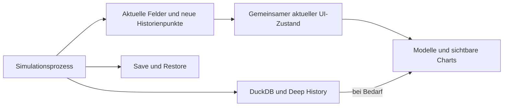

# Kojak Street – Performance-Remediation und Re-Audit

> Dated engineering evidence for the revision described below. Test counts,
> model versions and measurements are historical unless explicitly carried
> into the [current verification record](portfolio-closeout-2026-10-08.md).
> Raw cache artifacts remain local; source links identify modules, not the
> original audit line numbers.

Abgeschlossen: drei Optimierungsphasen, Regression und vollständiger Re-Audit. Messreihen ab 5. Oktober 2026; Abschluss: 06.10.2026 00:30 Mitteleuropäische Sommerzeit.

<!-- final-overview -->
**Ergebnis:** Der Tageswechsel in der reifen Welt ohne Chart sinkt im Median von 3,50 auf 1,85 Sekunden. Der echte manuelle Step sinkt für dieselben ersten drei Tage von 42,02 auf 2,12 Sekunden; die Antwort von 183,37 auf 2,34 MB. 330 Tests bestehen; der 365-Tage-Vergleich zeigt keine fachliche Abweichung.

**Trade-off:** Normale Tage ohne Flush im ersten Qt-Jahr liegen bei 1,26 → 1,41 Sekunden. Der vollständigere aktuelle UI-Zustand kostet zusätzliche Arbeit. Save/Load bleibt ein schwergewichtiger Vollzustands-Pfad.
<!-- /final-overview -->

## Referenz und Messverfahren

Ausgangspunkt ist Commit `52b18024b9939c1fd57ff6e2e09acda3331813aa`. Der ursprüngliche Quellstand ist unter `.cache/performance-remediation/reference-source.zip` gesichert, die damaligen Auditwerkzeuge separat unter `reference-audit-tools.zip`. Das Manifest `reference-manifest.json` enthält die SHA-256-Prüfsummen der Referenzdaten einschließlich Spielstände und DuckDB-Datei. Seed: 1729. Der frühere Bericht `day-transition-performance-audit-2026-10-05.md` bleibt erhalten.

Die unveränderte Ausgangsversion besteht die vollständige Testsuite: **302 Tests, 936,85 Sekunden**. Die ersten gezielten History-Tests bestehen mit **66 Tests, 42,22 Sekunden**. Nachfolgende Änderungen erhalten weitere Prüfungen.

T0 ist die Anforderung eines Tages, T1 das Ende des Simulationskerns, T2 das Ende der Übernahme im Parent, T3 das Ende der Aktualisierung der aktiven Ansicht und T4 der erste Heartbeat nach Zeichnung und Abschluss ausstehender UI-Arbeit. Absichtliche Spielpausen, Einrichtung und Laden werden getrennt gehalten. Profiler- und Speicherdiagnosen sind keine Latenz-Baselines. Der Abschluss-Slot und die UI-Aktualisierung werden ausdrücklich auf dem Qt-Hauptthread geprüft.

## Phase 1: History

Die UI normalisiert ihre lokalen Historien beim Laden. `IncrementalHistory` hängt einen neueren Tag an oder ersetzt denselben Kalendertag. Rückdatierte, unlesbare und extern umgeordnete Listen verwenden den bisherigen Merge. Datumsinterpretationen werden nach unveränderlichem Datumstext begrenzt zwischengespeichert. Die Begrenzung auf 520 lokale Punkte und unbegrenzte ALL-Cache-Einträge bleiben bestehen; der Cache enthält weiterhin höchstens 32 Serien.

Betroffen sind `chart_series.py`, `chart_history_cache.py`, `markets_view.py` und der Live-Candle-Pfad in `asset_chart_panel.py`. Historienpunkte werden als unveränderliche Werte behandelt; öffentliche Listenmutationen entwerten den Nachweis der Sortierung. Der alte Merge bleibt für Laden, Korrekturen und sichtbare Chartaufbereitung verfügbar.

Die Tests vergleichen 800 neue, doppelte und rückdatierte Punkte einschließlich deutsch/ISO-formatierter Daten und des 520-Punkte-Überlaufs exakt mit dem bisherigen Merge. Ein weiterer Test verbietet einen Merge bei normalem Append/Replace. ALL, Candle-OHLC und Cache-Kopien werden separat geprüft.

Alle fünf Varianten liefen jeweils über dieselben 20 reifen Spieltage. Datum und ökonomische/RNG-Endsignatur sind in allen fünf Vergleichen exakt gleich. Mediane in Millisekunden, einschließlich des Reporting-Tages innerhalb dieser 20 Tage:

| Ansicht | T0→T4 vorher | Nach History-Fix | Beschleunigung | History vorher | History nachher | T3−T2 vorher/nachher | T4−T2 vorher/nachher |
|---|---:|---:|---:|---:|---:|---:|---:|
| Ohne Chart | 3.495,58 | 428,44 | 8,16× | 3.033,32 | 7,53 | 3.093,07 / 66,29 | 3.133,49 / 82,01 |
| Detail Line ALL | 3.862,91 | 592,18 | 6,52× | 3.317,75 | 10,61 | 3.399,80 / 103,19 | 3.485,31 / 244,42 |
| Detail Candle ALL | 4.144,00 | 459,33 | 9,02× | 3.546,69 | 8,21 | 3.645,83 / 75,39 | 3.721,32 / 153,16 |
| Preview ALL | 4.140,33 | 498,58 | 8,30× | 3.503,36 | 7,83 | 3.602,66 / 77,91 | 3.741,80 / 165,08 |
| Detail ALL + EMA 20/50/200 | 4.143,17 | 500,86 | 8,27× | 3.496,18 | 7,94 | 3.619,10 / 86,49 | 3.724,94 / 163,07 |

Die ergänzende Aufrufzählung nutzt jeweils denselben ersten reifen Tag mit separatem Profiler. Ohne Chart: Full-Merges **2.516 → 0**, `history_date` **1.841.712 → 2.516**, `history_ordinal` **920.856 → 2.516**, `fromisoformat` **920.856 → 1**, `sorted` **2.521 → 5**. Mit sichtbarem Line-/Candle-/Previewchart bleiben drei Merges für dessen Aufbereitung. Die Screenshot-Prüfung von Line ALL und Candle ALL zeigt die vollständige Zeitachse und aktualisierten Kurse.

Nach dem zusätzlichen Candle-Test: **10/10 Tests in `test_incremental_history.py` bestanden (1,47 s)**. Der Zwischenstand ist als `history-source` samt Prüfsummen eingefroren. Rohdaten und exakte Vergleichsrechnung: `.cache/performance-remediation/history-after/` und `history-comparison.json`.

## Phase 2: DuckDB

Diagnose und Vergleichsmessungen werden unter `.cache/performance-remediation/duckdb-*` abgelegt. Der Vergleich umfasst Parameterübergabe, CSV/COPY und spaltenweise gebundene Listen, jeweils mit exakter Rückleseprüfung. Die produktive Flush-Messung trennt SQL-Aufrufe, Dateivolumen, Compaction und Commit.

DuckDBs `GetPythonObjectType` prüft in der eingesehenen Upstream-Implementierung `pandas.NaT` und `pandas.NA`, bevor normale Zahlen und Strings klassifiziert werden. Die installierte Version wird zusätzlich mit einzelnen Python-Datentypen und Importzählung untersucht. Quelle: [DuckDB Python conversion](https://github.com/duckdb/duckdb-python/blob/main/src/native/python_conversion.cpp). Die Einstellung `ALLOW_QUOTED_NULLS` erlaubt, echte NULL-Werte von gleichlautenden Texten zu unterscheiden: [DuckDB CSV-Import](https://duckdb.org/docs/preview/data/csv/overview).

Die Typ-Probes der installierten Version bestätigen: `None` verursacht keine Prüfung; `bool`, `int`, `float`, `str`, NaN und Infinity verursachen jeweils genau zwei fehlgeschlagene Importversuche. pandas wurde nicht installiert und der Importmechanismus nicht produktiv manipuliert.

| Isolierter Kandidat, Median aus 5 Läufen inkl. Commit | 15 Zeilen | 460 Zeilen | pandas-Versuche bei 460 Zeilen |
|---|---:|---:|---:|
| Bisheriges executemany | 54,86 ms | 1.681,48 ms | 2.760 |
| Sichere CSV/COPY-Übergabe | 7,41 ms | 19,44 ms | 0 |
| Gebundene Spaltenlisten mit UNNEST | 47,66 ms | 1.473,17 ms | 2.766 |

UNNEST wurde verworfen: Die Python-Werte durchlaufen weiter die teuren Typprüfungen. Ein separater Vergleich von 80 Abfragen mit festen Compaction-Konstanten ergibt 538,93 ms und 960 Importversuche bei Binding gegenüber 27,14 ms und null Versuchen mit typisierten SQL-Konstanten. In der Produktion sind diese Konstanten ausschließlich geprüfte Schema-Identifier, Enumwerte und Datum-Objekte; Nutzerdaten werden dort nicht als SQL-Text interpoliert.

Produktive Änderungen in `core/data_store.py`: Nur `phase_metric_daily/current` wechseln von executemany zu CSV/COPY. Alle Nicht-NULL-Werte werden zitiert, `None` erhält einen unzitierten NULL-Marker; damit bleiben leere Texte und der Text `\\N` unterscheidbar. Aggregationskonstanten vermeiden wiederholtes Binding. Transaktionsgrenzen, Commit, Rollback, Facts-COPY, Current-Replacement, Retention und Aggregationsformeln bleiben erhalten.

| Vollständiger Flush-Vergleich, Median aus jeweils 3 identischen reifen Zuständen | Vorher | Nachher |
|---|---:|---:|
| Gesamter Tag einschließlich Flush | 7.256,44 ms | 4.906,32 ms |
| `store.flush` | 6.776,31 ms | 4.337,35 ms |
| DuckDB-API | 6.006,63 ms | 3.536,78 ms |
| BEGIN | 0,44 ms | 0,44 ms |
| INSERT einschließlich Aggregation | 3.353,87 ms | 933,67 ms |
| Davon executemany | 1.876,05 ms | 41,90 ms |
| COPY | 675,03 ms | 689,31 ms |
| DELETE | 305,25 ms | 307,97 ms |
| COMMIT | 1.509,51 ms | 1.686,63 ms |
| History Compaction | 1.489,55 ms | 937,75 ms |
| Current-Tabellen ersetzen | 399,68 ms | 374,36 ms |
| Große CSV-Batches schreiben | 713,54 ms | 723,81 ms |
| Neue Telemetrie-CSV schreiben | – | 1,42 ms |
| `phase_metric_daily` INSERT/COPY | 1.783,28 ms | 13,27 ms |
| `phase_metric_current` INSERT/COPY | 58,68 ms | 11,35 ms |
| pandas-Versuche | 4.260 | 534 |
| Import-/Suchzeit | 2.311,70 ms | 302,73 ms |
| API-Aufrufe / ausgeführte Statements inkl. executemany-Zeilen | 151 / 628 | 151 / 155 |
| CSV-Volumen | 17.002.277 Bytes | 17.027.459 Bytes |

Verschachtelte Zeiten sind nicht additiv. Current-Replacement und große Facts-COPY-Batches zeigen keinen belegten Grund für einen Umbau. Commit bleibt ein relevanter, schwankender Persistenzaufwand; seine Garantien wurden nicht zugunsten eines schnelleren Messwertes geändert. Die verbleibenden 534 Importversuche stammen aus kleinen gebundenen Abfragen, insbesondere Datumsfiltern und Metadaten. Die erste Diagnose zählte beim Schließen zusätzliche Imports außerhalb des Messfensters mit; diese Läufe sind als `*-exploratory-close-counter` archiviert. Die Tabelle verwendet ausschließlich die wiederholten, korrigiert abgegrenzten Messungen.

**23 fokussierte Tests bestanden (14,55 s)**: Batch-Roundtrip einschließlich Unicode, Zeilenumbrüchen, Anführungszeichen, NULL, leerem Text, NaN/Infinity; Rollback nach fehlgeschlagenem Flush, erneuter Flush, Wiederöffnen der Datenbank, Dateibereinigung auch bei COPY-Fehler und Pfad mit Apostroph, Deep History und Checkpoint-Vertrag. Der Zustand nach Phase 2 ist als `step-reference-source` eingefroren.

## Phase 3: Verbrauchsmatrix des manuellen Steps

| Bereich | Bisheriges Volumen im reifen Vollsnapshot | Consumer | Bedarf am neuen Tag | Lokal vorhanden / Delta |
|---|---:|---|---|---|
| Aktien | 85,9 MB, darunter 56,3 MB Kurshistorie und 22,5 MB Open-Interest-Historie | Markttabelle, Detail, Portfolio, Supply Chain | Quotes, aktuelle Kennzahlen, neue Historienpunkte | Vorhandene Historien erhalten, Änderungen übertragen |
| Derivate | 24,8 MB | Märkte, Detail, Handel, Portfolio | Preise, Vertragsdaten, Positionierung | Aktuelle Felder und Historienänderungen |
| Fonds | 19,3 MB | Märkte, Detail/Allokation, Portfolio | NAV, AUM, Bestände, Kennzahlen | Feldänderungen und Historienänderungen |
| Verarbeitete Produkte | 16,9 MB | Supply Chain, Länderdetail, Handelskarte | Mengen, Engpässe, Preise und Diagramme | Aktueller Zustand plus Historienänderungen |
| Indizes | 15,3 MB | Märkte, Charts, Ticker | Quotes, Zusammensetzung, Historie | Aktuelle Felder und neue Punkte |
| Länder und globale Makrodaten | Im Vollsnapshot enthalten | Makro, Global Macro, News, Handelskarte | Vollständige aktuelle Kennzahlen, sektorale und regionale Daten | Aktuelle Felder und neue Historienpunkte |
| FX und Bonds | Im Vollsnapshot enthalten | Forex, Bondmarkt, Portfolio | Kurse, Zinsen, Angebote, Bestände, Charts | Aktuelle Felder und Historienänderungen |
| Portfolio | Im Vollsnapshot enthalten | Portfolio, Orderprüfung, Topbar | Cash, Positionen, Futures, Kredite, Realisierungen | Vollständige aktuelle Änderungen |
| Persistente Deep History | Eigener History-/DuckDB-Pfad | ALL, lange Zeiträume | Bedarfsgesteuertes Nachladen | Separater History-Vertrag bleibt |
| RNG, Simulationscaches, Savegame | Nicht für tägliche Darstellung erforderlich | Simulationskern, Save/Load | Kein täglicher UI-Bedarf | Worker und Checkpoint bleiben maßgeblich |

Der bisherige Step setzt `force_refresh=True`; dadurch fordert `LiveSimulationProcess.advance_days` einen Snapshot für das aktive Profil. Der Timer verwendet `status`. Dessen bisherige Rückübernahme aktualisiert nur einen Teil der aktuellen Felder. Deshalb reicht das Umschalten des Flags allein nicht aus: Es würde die bisherige Step-Aktualität von Fundamentaldaten, globalen Makrodaten und Handelskarte nicht gewährleisten.

## Abschließende Nachweise

### Geänderte Produktionsdateien

Alle Pfade beziehen sich auf das Projektverzeichnis. Die ökonomischen Engine-Module bleiben unverändert.

| Datei | Änderung |
|---|---|
| `src/kojakstreet/ui_qt/chart_series.py` | Inkrementelle History und begrenzter Datumscache |
| `src/kojakstreet/ui_qt/chart_history_cache.py` | Inkrementelle Cache-Endpunkte, ALL und mehrtägige Aktualisierung |
| `src/kojakstreet/ui_qt/views/markets_view.py` | Laufende History, Zustandsisolation, Instrumentwechsel und Rückladen |
| `src/kojakstreet/ui_qt/widgets/asset_chart_panel.py` | Aktuelle Live-Candles und Positionierungsdaten |
| `src/kojakstreet/core/data_store.py` | Telemetrie-COPY und geprüfte Aggregationskonstanten |
| `src/kojakstreet/day_delta.py` (neu) | Versionierter öffentlicher Tageszustand, Änderungsoperationen und Datendecoder |
| `src/kojakstreet/live_worker.py` | Tagesänderungen statt normalem Vollsnapshot, Revisionen und History-Datumsgrenze |
| `src/kojakstreet/live_process.py` | Gemeinsamer UI-Zustand, Decoder außerhalb des Hauptthreads, History-Ergänzung und Restore |
| `src/kojakstreet/adapters/legacy_state.py` | Bestehende lokale FX-History im vollständigen UI-Profil verfügbar machen |
| `src/kojakstreet/ui_qt/app.py` | Benutzer-Step nutzt Tagesvertrag; aktive Ansichten erhalten aktuelle Daten |
| `src/kojakstreet/ui_qt/models/market_table_model.py` | Instrumentwechsel vor schneller Zeilenaktualisierung erkennen |
| `src/kojakstreet/ui_qt/widgets/stock_detail_dialog.py` | Kennzahlen und Supply-Chain-Daten bei Live-Updates aktuell halten |

Die abschließenden Nachweise und Messwerte folgen unten; der ursprüngliche Auditbericht bleibt als Referenz erhalten.

### Implementierter Step-Vertrag und gezielte Regression

`day_delta.py` führt einen versionierten Tagesvertrag mit Ausgangsrevision ein. Er überträgt geänderte öffentliche UI-Felder sowie Append-, Replace-, Lösch- und Korrekturoperationen für Historien. Eine getrennte Referenz im Worker verhindert, dass der Vergleich die Simulationsdaten verändert. Bereits vorhandene Punkte werden nicht erneut als Vollsnapshot serialisiert. Interne Schlüssel mit Unterstrich bleiben im Simulationsprozess. Die vollständigen öffentlichen UI-Felder bleiben erhalten, auch wenn ihre Ansicht gerade verborgen ist.

Große Nachrichten nutzen innerhalb der bestehenden JSON-Prozessnachricht einen komprimierten Datenkörper in begrenzten Blöcken. Der Decoder erlaubt ausschließlich Daten und verweigert Python-Klassen/Funktionen. Seltene Datum-/Arraywerte verwenden weiterhin die bestehenden Checkpoint-Tags. Dies ändert weder das Savegame-Format noch den analytischen Store. Unveränderliche Transport-Tupel und begrenzte Speicherbereinigung beim Einlesen vermeiden unnötige vollständige Garbage-Collector-Durchläufe mitten im großen temporären Objektgraphen; die automatische Speicherbereinigung wird anschließend wiederhergestellt. Ein expliziter Vollsnapshot bleibt für Restore und Debug vorhanden. Eine fehlende oder falsche Delta-Revision führt im normalen Tagespfad zu einem Fehler, nicht zu einem versteckten Vollsnapshot.

Timer und Benutzer-Step verwenden denselben Vertrag. Mehrtägige Aufträge werden in höchstens fünf Tage große Antworten aufgeteilt; sämtliche dazwischen entstandenen Historienpunkte bleiben enthalten. Der Parent übernimmt genau eine gemeinsame aktuelle UI-Repräsentation. Markttabellen erhalten diese aktuellen Felder; nur sichtbare Charts bereiten ihre Serien auf. Deep-History-Ergebnisse bekommen eine Datumsgrenze und werden mit neueren lokalen Punkten ergänzt. Erst eine tatsächliche Lücke im lokalen Zeitraum erfordert erneutes Nachladen. Der vollständige UI-Zustand hält dafür auch bei FX die vorhandenen 520 lokalen Punkte bereit.

Beim Prozessstart verwenden Worker und Parent dieselbe Checkpoint-Repräsentation einschließlich der bestehenden Begrenzung bestimmter Anzeigehistorien. Das verhindert unterschiedliche Delta-Ausgangszustände nach bereits gespielten Tagen. UI-Zeilen erhalten eigene Dictionaries, damit lokale Chartnormalisierung die maßgebliche Delta-Historie nicht verändert. Änderungen am Instrumentuniversum lösen einen Modell-Neuaufbau aus.

Zusätzliche Langlaufkontrollen sichern den Cache ab: Die höchstens 32 gespeicherten Chartserien übernehmen neue echte OHLC-Punkte einschließlich aller Zwischentage eines Mehrtagessprungs. Damit bleibt ALL auch über das lokale 520-Punkte-Fenster hinaus vollständig. Eine gezielte Probe erhält exakt 1.330 Punkte, obwohl lokal nur 520 gehalten werden, und ersetzt einen korrigierten Punkt desselben Tages korrekt. Beim Zurückladen eines früheren Datums werden spätere lokale und gecachte Punkte verworfen. Deep-History-Ergebnisse ersetzen außerdem einen zuvor am selben Kalendertag abgefragten Endpunkt mit dessen endgültigem aktuellem Wert. Der Worker gibt temporäre Delta-Operationslisten vor einer jungen Speicherbereinigung frei; eine explizite Prüfung schützt den ursprünglichen GC-Aktivierungszustand sowohl bei Erfolg als auch bei Fehlern.

Diese zusätzlichen Decoder-, Cache- und Rückladeprüfungen bestehen zusammen mit den bisherigen History-Tests: **23 Tests, 1,56 s**. Der letzte Produktionsstand ist unter `release-source` mit SHA-256-Manifest gesichert. Alle abschließenden Messreihen und die gesamte Suite werden auf diesem eingefrorenen Stand ausgeführt.

**111 fokussierte Tests bestanden (99,81 s)**, zusätzlich der bestehende Prozess-/Responsivitäts-/SaveLoad-Test **1/1 in 83,19 s** mit unveränderten Grenzen: 30 Tage innerhalb 20 s, größter Heartbeat-Abstand unter 150 ms, letzte Zustandsübernahme unter 50 ms. Neue Tests prüfen sämtliche öffentlichen Felder über 30 synthetische Tage, Korrekturen, Löschungen, Instrumentwechsel, unveränderte Referenzen, nicht übertragene alte Historien, große binäre Nachrichten, gesperrte Klasseninstanziierung und UI-Datenisolation. Der echte Benutzer-Step und ein Timer-Tick nach demselben geladenen Spielstand werden über alle öffentlichen Felder/Historien und die ökonomische/RNG-Signatur exakt verglichen, anschließend gegen einen ausdrücklich angeforderten Worker-Vollsnapshot und durch Wechsel in alle neun Ansichten geprüft. Frühere Prototypen überschritten die bestehenden Reaktionszeit-Grenzen; sie wurden korrigiert, ohne diese Tests oder Grenzen abzuschwächen. Die Produktionsdateien bestehen die Ruff-Prüfung.

## Finaler Re-Audit

Alle folgenden Latenzreihen wurden nach den drei Änderungen erneut und nacheinander gemessen. Einrichtung, Laden und die absichtliche Spielpause sind ausgeschlossen. cProfile und tracemalloc laufen separat. Mediane verschachtelter Teilzeiten sind nicht additiv. MB bedeutet 1.000.000 Bytes. Die Messumgebung und Definitionen des ursprünglichen Audits gelten weiter; T2 umfasst jetzt auch das Einlesen und Anwenden des expliziten Tages-Deltas.

**Gesamte Suite: 330 Tests bestanden**, 768,43 s. **365-Tage-Vergleich: 46 Signaturfelder je Tag**, 31 Datenbanktabellen, keine Abweichung. Die vollständigen Checkpoints an Tag 15, 31, 181 und 365 sowie der abschließende Checkpoint stimmen einschließlich Historien, Reihenfolge und RNG exakt überein. Diese Checkpoints verwenden den bestehenden Save-Vertrag mit seinen Grenzen für lokale Anzeigehistorien; die vollständige persistente History wird zusätzlich durch den Datenbankvergleich geschützt. In der Datenbank werden nur die zufällige History-ID und gemessene Telemetrie-Laufzeiten aus dem Wertvergleich ausgenommen; Tabelleninhalte, Zeilenzahlen, ökonomische Zahlen und restliche Metadaten bleiben einbezogen. Der Audit prüft zusätzlich 522 Qt-Tagesmessungen in 15 Reihen auf Abschluss, Reihenfolge der Zeitpunkte, Hauptthread, Modelle und Worker-Beendigung. Ein unverändertes Produktionsfenster bestätigt den Hauptthread separat.

### Abschließender Vorher/Nachher-Vergleich

| Reife Welt | n | Vorher T0→T4 ms | Final T0→T4 ms | Faktor | Final p95 ms | Größter Heartbeat-Abstand ms |
| --- | --- | --- | --- | --- | --- | --- |
| Ohne Chart | 20 | 3.495,58 | 1.854,88 | 1,88× | 2.139,94 | 321,99 |
| Detail Line ALL | 20 | 3.862,91 | 1.946,50 | 1,98× | 2.345,28 | 398,68 |
| Detail Candle ALL | 20 | 4.144,00 | 1.813,46 | 2,29× | 2.087,03 | 396,40 |
| Preview ALL | 20 | 4.140,33 | 1.970,91 | 2,10× | 2.575,97 | 576,80 |
| Detail ALL + EMA 20/50/200 | 20 | 4.143,17 | 1.928,61 | 2,15× | 2.177,33 | 338,34 |

Der finale Timer-Vertrag aktualisiert gegenüber dem alten reinen Quote-Pfad zusätzlich alle öffentlichen Unternehmens-, Länder-, Portfolio- und Historienfelder. Deshalb ist Phase 1 als isolierter History-Gewinn getrennt ausgewiesen. Der abschließende Wert ist die tatsächlich ausgelieferte Kombination aller Änderungen, einschließlich dieses vollständigeren Zustandsvertrags.

| Manueller Benutzer-Step | n | Median T0→T4 ms | Median Antwort MB | Größter Heartbeat-Abstand ms |
| --- | --- | --- | --- | --- |
| Vor Phase 3, gleiche ersten 3 Tage | 3 | 42.023,06 | 183,37 | 8.402,01 |
| Nach Phase 3, gleiche ersten 3 Tage | 3 | 2.122,95 | 2,34 | 173,65 |
| Nach Phase 3, alle 20 Tage | 20 | 1.951,35 | 2,32 | 360,47 |
| Nach Phase 3, Heavy/EMA, 20 Tage | 20 | 1.925,21 | 2,32 | 370,78 |

| Step-Teilzeit ms, verschachtelt | Vorher n=3 | Nachher gleiche 3 | Nachher n=20 |
| --- | --- | --- | --- |
| Worker State-Encoding: vorher Vollstate, nachher Status | 16.154,94 | 0,14 | 0,14 |
| Worker Tages-Diff + Datenkörper | 0,00 | 668,65 | 645,34 |
| JSON encode | 5.059,29 | 29,78 | 29,36 |
| Pipe write | 1.929,65 | 20,87 | 31,88 |
| JSON decode | 4.316,72 | 22,45 | 20,12 |
| Datenkörper decode | 0,00 | 648,75 | 518,40 |
| State-Rekonstruktion: vorher Vollstate, nachher Status | 8.191,59 | 0,05 | 0,04 |
| Tagesänderungen anwenden | 0,00 | 42,73 | 57,87 |
| Markt-Vollrefresh einschließlich History-Normalisierung | 4.187,73 | 0,00 | 0,00 |
| Inkrementelle Markt-/Quote-Aktualisierung | 0,00 | 22,26 | 22,62 |
| UI T3−T2 | 4.524,45 | 106,18 | 106,98 |
| UI/Chart/Paint T4−T2 | 4.599,71 | 165,89 | 161,53 |

Der gemeinsame Helfer `game_state_payload` wird weiterhin für den kleinen Statuskopf verwendet. Seine verbleibende minimale Laufzeit bedeutet keinen Vollsnapshot. Alle 40 abschließenden Benutzer-Steps fordern `force_refresh=False` an und erzeugen jeweils genau ein Tages-Delta. Der Code wählt hierfür ausdrücklich das Statusprofil; die zusätzlichen aktuellen Felder und neuen Historienpunkte stehen im Tages-Delta. Die fehlende-Delta-Fehlerprüfung verhindert einen stillen Vollsnapshot-Ersatz.

Beim alten Benutzer-Step steckt die History-Normalisierung im vollständigen Markt-Refresh. Ihre Einzelzeit wurde in dieser Step-Reihe nicht separat isoliert. Ein nicht aufgerufener Live-Append-Hook würde hier fälschlich nach null History-Aufwand aussehen. Die Tabelle zeigt deshalb den gesamten Refresh einschließlich dieser Arbeit; die getrennten History-Aufrufzahlen stehen in Phase 1 und im finalen UI-Profil.

### Alle Tagtypen und Jahresgrenze

| Reihe / Tagtyp | n | Min ms | Median ms | Mittel ms | p95 ms | Max ms |
| --- | --- | --- | --- | --- | --- | --- |
| Headless erstes Jahr: alle Tage | 365 | 138,91 | 171,69 | 272,06 | 254,79 | 3.923,25 |
| Headless erstes Jahr: normal ohne Flush | 331 | 138,91 | 169,42 | 173,64 | 210,39 | 256,28 |
| Headless erstes Jahr: Reporting | 12 | 230,54 | 256,38 | 261,63 | 306,88 | 340,15 |
| Headless erstes Jahr: Monatsende ohne 31.12. | 11 | 158,05 | 179,34 | 628,36 | 2.641,98 | 3.183,97 |
| Headless erstes Jahr: 31.12. | 1 | 159,25 | 159,25 | 159,25 | 159,25 | 159,25 |
| Headless erstes Jahr: Flush | 12 | 2.100,00 | 3.072,79 | 3.075,23 | 3.812,27 | 3.923,25 |
| Qt erstes Jahr: alle Tage | 365 | 960,21 | 1.428,83 | 1.642,02 | 2.930,12 | 5.864,48 |
| Qt erstes Jahr: normal ohne Flush | 331 | 960,21 | 1.413,41 | 1.527,96 | 2.489,86 | 3.199,65 |
| Qt erstes Jahr: Reporting | 12 | 1.462,25 | 1.893,74 | 2.177,62 | 3.348,35 | 3.678,33 |
| Qt erstes Jahr: Monatsende ohne 31.12. | 11 | 1.065,41 | 1.369,29 | 1.783,13 | 3.818,97 | 4.365,03 |
| Qt erstes Jahr: 31.12. | 1 | 1.994,71 | 1.994,71 | 1.994,71 | 1.994,71 | 1.994,71 |
| Qt erstes Jahr: Flush | 12 | 3.272,91 | 4.439,52 | 4.456,51 | 5.485,37 | 5.864,48 |
| Identische Jahresgrenze: 31.12. | 5 | 1.974,70 | 2.086,99 | 2.070,40 | 2.135,28 | 2.140,59 |
| Identische Jahresgrenze: 01.01. | 5 | 1.616,85 | 1.705,86 | 1.818,92 | 2.060,85 | 2.075,05 |
| Identische Jahresgrenze: 03.01. / Bond-Pfad | 5 | 1.722,77 | 1.888,49 | 1.897,52 | 2.096,23 | 2.119,23 |
| Headless reife Welt | 20 | 161,32 | 186,81 | 197,35 | 251,12 | 325,26 |

| Erstes Qt-Jahr: Original gegen endgültigen Stand | Vorher Median ms | Nachher Median ms | Faktor |
| --- | --- | --- | --- |
| Alle 365 Tage | 1.360,22 | 1.428,83 | 0,95× |
| Normal ohne Flush | 1.259,01 | 1.413,41 | 0,89× |
| Reporting | 1.664,93 | 1.893,74 | 0,88× |
| Monatsende | 1.596,07 | 1.369,29 | 1,17× |
| Flush | 7.836,70 | 4.439,52 | 1,77× |

Die Summe der 365 gemessenen Tagesübergänge beträgt **582,63 → 599,34 Sekunden** (2,87 % länger). Einrichtung, Laden und die absichtliche Spielpause sind in dieser Summe nicht enthalten. Damit verbessert die Kombination den reifen Zustand und den manuellen Step deutlich, beschleunigt aber den hier gemessenen kompletten ersten Jahreslauf nicht.

Der Vergleich des ersten Jahres ergänzt die reife Welt: Kleine Historien bieten weniger Einsparpotenzial. Der vollständigere öffentliche Tageszustand verursacht gleichzeitig zusätzliche Vergleiche und Übertragung. Ein Faktor unter 1 in dieser Tabelle bedeutet eine Verlangsamung dieses Tagtyps; die isolierten History-Gewinne dürfen deshalb nicht als pauschale Beschleunigung jeder Spielsituation gelesen werden.

| Zusätzliche Langlaufkorrektur, normale Tage ohne Flush | n | T0→T4 Median ms | Delta-Erzeugung Median ms | Worker GC Median ms |
| --- | --- | --- | --- | --- |
| Delta-Prototyp vor Worker-GC-Korrektur | 331 | 3.090,31 | 2.350,39 | 1.766,39 |
| Endgültiger Stand | 331 | 1.413,41 | 659,53 | 65,85 |

Der erste vollständige Qt-Jahreslauf deckte im Delta-Prototyp einen neuen Engpass auf: Während der Erzeugung kurzlebiger Operationslisten und Pickle-Memos wurden diese Objekte in ältere GC-Generationen verschoben. Vollständige Sammlungen scannten dadurch wiederholt den immer größeren Weltzustand; am Ende lagen einzelne solche Sammlungen über drei Sekunden. Der Encoder gibt jetzt seine temporären Listen vor einer gezielten jungen Sammlung frei und stellt die automatische Speicherbereinigung unmittelbar wieder her. Die Wirtschaft bleibt unberührt. Der endgültige komplette Re-Audit wurde danach wiederholt; der erste Lauf ist separat als Diagnose archiviert. Auch die anfänglichen Step-Messungen mit irrtümlicher Modell-Neuerstellung durch überlappende Ticker sind ausschließlich als Diagnose erhalten.

| Zeitgrenzen, Median ms | T1−T0 | T2−T1 | T3−T2 | T4−T3 | T4−T0 |
| --- | --- | --- | --- | --- | --- |
| Ohne Chart | 216,61 | 1.526,09 | 106,45 | 53,75 | 1.854,88 |
| Detail Line ALL | 227,80 | 1.474,43 | 122,37 | 73,67 | 1.946,50 |
| Detail Candle ALL | 224,32 | 1.307,64 | 131,27 | 100,15 | 1.813,46 |
| Preview ALL | 234,35 | 1.523,38 | 118,97 | 75,32 | 1.970,91 |
| Detail ALL + EMA 20/50/200 | 214,30 | 1.466,68 | 139,90 | 71,37 | 1.928,61 |
| Qt erstes Jahr: alle Tage | 185,31 | 1.122,71 | 62,13 | 15,76 | 1.428,83 |
| Qt erstes Jahr: normal ohne Flush | 184,51 | 1.108,27 | 62,87 | 15,91 | 1.413,41 |
| Qt erstes Jahr: Reporting | 260,85 | 1.514,55 | 65,77 | 18,67 | 1.893,74 |
| Qt erstes Jahr: Monatsende ohne 31.12. | 183,37 | 1.116,53 | 45,85 | 14,22 | 1.369,29 |
| Qt erstes Jahr: 31.12. | 218,25 | 1.657,13 | 83,24 | 36,09 | 1.994,71 |
| Qt erstes Jahr: Flush | 174,05 | 4.206,43 | 52,11 | 13,79 | 4.439,52 |
| Identische Jahresgrenze: 31.12. | 243,47 | 1.539,35 | 245,04 | 57,20 | 2.086,99 |
| Identische Jahresgrenze: 01.01. | 286,40 | 1.269,17 | 127,38 | 86,03 | 1.705,86 |
| Identische Jahresgrenze: 03.01. / Bond-Pfad | 241,59 | 1.537,10 | 111,52 | 58,42 | 1.888,49 |
| Manueller Step, finale Wiederholung | 236,27 | 1.559,11 | 118,81 | 63,75 | 1.962,82 |

### Finaler History-Aufwand und Aktualisierung der Oberfläche

| Separates UI-Profil | n | Append-Aufrufe | Merges | history_date | history_ordinal | fromisoformat | sorted |
| --- | --- | --- | --- | --- | --- | --- | --- |
| Ohne Chart | 3 | 0,00 | 0,00 | 0,00 | 0,00 | 28,67 | 5,00 |
| Detail Line ALL | 3 | 0,00 | 3,00 | 4.043,00 | 1.841,00 | 1,00 | 10,33 |
| Detail Candle ALL | 3 | 0,00 | 3,00 | 3.089,33 | 1.510,33 | 1,00 | 11,67 |
| Preview ALL | 3 | 0,00 | 3,00 | 4.043,00 | 1.841,00 | 1,00 | 12,33 |
| Detail ALL + EMA 20/50/200 | 3 | 0,00 | 3,00 | 4.043,00 | 1.841,00 | 1,00 | 10,33 |

| 20 reife Tage | n | Sichtbare Chart-Aufrufe | Verborgene Chart-Aufrufe | Paints | Max-Gap je Tick Median ms | Max-Gap je Tick p95 ms | Antwort MB Median |
| --- | --- | --- | --- | --- | --- | --- | --- |
| Ohne Chart | 20 | 0 | 0 | 2194 | 138,93 | 312,05 | 2,32 |
| Detail Line ALL | 20 | 40 | 0 | 3264 | 144,15 | 360,34 | 2,32 |
| Detail Candle ALL | 20 | 40 | 0 | 2853 | 111,42 | 321,15 | 2,32 |
| Preview ALL | 20 | 40 | 0 | 3245 | 144,08 | 315,88 | 2,32 |
| Detail ALL + EMA 20/50/200 | 20 | 40 | 0 | 3065 | 136,22 | 337,36 | 2,32 |

Die finalen Bilder `qt-mature-detail-valid.png`, `qt-mature-candle-valid.png`, `qt-mature-preview-valid.png` und `qt-mature-heavy-valid.png` wurden zusätzlich visuell geprüft: ALL-Zeitachse, Line beziehungsweise Candle mit Höchst-/Tiefstwerten, aktueller Kurs, Positionierungsanzeige und die drei EMA-Linien in der Heavy-Variante sind vorhanden. Die numerische History-Gleichheit wird durch die automatisierten Vergleiche geprüft; die Bildkontrolle ergänzt diese um die tatsächliche Darstellung.

### Verbleibende Zeitanteile und Profile

| Reife normale Tage ohne Flush: Teilzeit | Median ms | p95 ms |
| --- | --- | --- |
| simulation.core | 214,59 | 273,47 |
| store.record_day | 19,32 | 22,06 |
| store.flush | 0,00 | 0,00 |
| worker.day_delta | 634,82 | 702,82 |
| worker.state_encode | 0,14 | 0,15 |
| worker.json_encode | 29,24 | 38,91 |
| worker.pipe_write | 19,07 | 74,97 |
| parent.json_decode | 20,53 | 28,36 |
| parent.decode_day_delta | 501,25 | 648,33 |
| parent.apply_day_delta | 44,90 | 102,73 |
| parent.apply_result | 46,64 | 106,36 |
| ui.markets.append_live_history | 0,00 | 0,00 |

| Core-Phasen, reife normale Tage | Median ms | p95 ms |
| --- | --- | --- |
| asset_market | 98,33 | 127,85 |
| daily_production | 81,97 | 106,19 |
| daily_production_chain_core | 80,81 | 104,83 |
| derivatives | 24,29 | 28,93 |
| bond_market | 4,58 | 12,94 |
| global_macro | 2,70 | 3,69 |
| daily_crypto_inputs | 1,13 | 1,53 |
| derivative_rolls | 0,87 | 0,93 |
| credit_interest | 0,01 | 0,03 |
| spot_derivative_settlements | 0,01 | 0,01 |
| bond_portfolio | 0,01 | 0,01 |
| events | 0,01 | 0,01 |
| monthly_report | 0,00 | 0,01 |
| perpetuals | 0,00 | 0,00 |
| future_settlements | 0,00 | 0,00 |

#### cProfile normal, 3 Läufe, getrennte Diagnosezeiten

| Kumulativ: Funktion | Aufrufe/Lauf | Eigenzeit ms | Kumulativ ms |
| --- | --- | --- | --- |
| legacy_runtime.py:371 advance_day | 1,00 | 0,02 | 625,36 |
| day_transition_audit_support.py:190 step | 1,00 | 0,01 | 567,07 |
| simulation.py:57 step_day | 1,00 | 0,04 | 567,03 |
| simulation.py:110 _phase | 13,00 | 0,03 | 566,34 |
| day_transition_audit_support.py:85 measured | 13,00 | 0,67 | 337,51 |
| simulation.py:237 _update_daily_production | 1,00 | 0,00 | 258,87 |
| production_engine.py:45 update_daily_production_chain | 1,00 | 0,05 | 258,87 |
| production_chains.py:598 update_production_chain | 1,00 | 1,47 | 255,40 |
| simulation.py:124 _update_asset_market | 1,00 | 0,00 | 218,15 |
| asset_market_engine.py:16 update_daily_prices | 1,00 | 0,28 | 218,14 |
| market_calculations.py:49 update_markt_kurse | 1,00 | 24,21 | 217,87 |
| production_chains.py:928 _update_country_trade_flows | 1,00 | 23,94 | 116,87 |
| ~:0 &lt;method 'get' of 'dict' objects&gt; | 460.948,00 | 101,96 | 101,96 |
| production_chains.py:1243 _update_company_utilization | 1,00 | 14,60 | 80,91 |
| simulation.py:130 _update_derivatives | 1,00 | 0,01 | 68,69 |
| financial_products.py:103 update_financial_products | 1,00 | 1,09 | 68,63 |
| financial_products.py:344 _price_product | 566,00 | 0,31 | 61,84 |
| day_transition_audit_support.py:202 record | 1,00 | 0,00 | 58,27 |
| data_store.py:186 record_day | 1,00 | 0,21 | 58,24 |
| production_chains.py:1331 _record_company_quantity_history | 1.280,00 | 17,90 | 52,89 |

| Eigenzeit: Funktion | Aufrufe/Lauf | Eigenzeit ms | Kumulativ ms |
| --- | --- | --- | --- |
| ~:0 &lt;method 'get' of 'dict' objects&gt; | 460.948,00 | 101,96 | 101,96 |
| ~:0 &lt;built-in method builtins.max&gt; | 203.018,00 | 46,21 | 52,00 |
| financial_products.py:583 _government_bond_market_yield | 80,00 | 32,39 | 51,28 |
| market_calculations.py:49 update_markt_kurse | 1,00 | 24,21 | 217,87 |
| production_chains.py:928 _update_country_trade_flows | 1,00 | 23,94 | 116,87 |
| day_transition_audit_support.py:49 finish | 1,00 | 20,88 | 20,95 |
| ~:0 &lt;method 'setdefault' of 'dict' objects&gt; | 69.538,00 | 18,55 | 18,55 |
| production_chains.py:1331 _record_company_quantity_history | 1.280,00 | 17,90 | 52,89 |
| production_chains.py:952 append_history | 19.900,00 | 15,41 | 26,33 |
| production_chains.py:1243 _update_company_utilization | 1,00 | 14,60 | 80,91 |
| ~:0 &lt;built-in method builtins.min&gt; | 60.747,00 | 13,34 | 13,34 |
| production_chains.py:1350 _company_quantity_plan | 1.280,00 | 11,45 | 22,35 |
| data_store.py:1272 _bond_row_sets | 1,00 | 11,13 | 36,21 |
| ~:0 &lt;method 'append' of 'list' objects&gt; | 54.178,00 | 10,48 | 10,48 |
| market_calculations.py:619 _update_open_interest | 1.346,00 | 10,42 | 39,05 |
| psychology.py:114 daily_asset_psychology_values | 1.346,00 | 10,10 | 30,40 |
| production_chains.py:1460 _country_demand_weight | 2.480,00 | 9,76 | 17,98 |
| production_chains.py:748 _company_capacity | 3.840,00 | 9,19 | 18,61 |
| production_chains.py:1061 _match_country_trade | 1,00 | 9,07 | 21,72 |
| ~:0 &lt;method 'strftime' of 'datetime.date' objects&gt; | 1.487,00 | 7,80 | 15,93 |

#### cProfile report, 3 Läufe, getrennte Diagnosezeiten

| Kumulativ: Funktion | Aufrufe/Lauf | Eigenzeit ms | Kumulativ ms |
| --- | --- | --- | --- |
| legacy_runtime.py:371 advance_day | 1,00 | 0,02 | 989,68 |
| day_transition_audit_support.py:190 step | 1,00 | 0,01 | 818,58 |
| simulation.py:57 step_day | 1,00 | 0,04 | 818,54 |
| simulation.py:110 _phase | 12,00 | 0,03 | 817,75 |
| simulation.py:167 _run_monthly_company_report_if_due | 1,00 | 0,03 | 486,13 |
| day_transition_audit_support.py:85 measured | 17,00 | 0,83 | 451,18 |
| simulation.py:229 _update_monthly_production | 1,00 | 0,00 | 266,72 |
| production_engine.py:37 update_production_chain | 1,00 | 0,54 | 266,71 |
| production_chains.py:598 update_production_chain | 1,00 | 1,53 | 256,68 |
| simulation.py:124 _update_asset_market | 1,00 | 0,00 | 233,55 |
| asset_market_engine.py:16 update_daily_prices | 1,00 | 0,29 | 233,55 |
| market_calculations.py:49 update_markt_kurse | 1,00 | 26,37 | 233,26 |
| simulation.py:211 _update_monthly_companies | 1,00 | 0,00 | 183,43 |
| production_engine.py:26 update_companies | 1,00 | 0,01 | 183,43 |
| company_lifecycle.py:25 update_monthly_companies | 1,00 | 10,03 | 183,39 |
| day_transition_audit_support.py:202 record | 1,00 | 0,00 | 171,08 |
| data_store.py:186 record_day | 1,00 | 0,56 | 171,05 |
| ~:0 &lt;method 'get' of 'dict' objects&gt; | 690.181,00 | 168,76 | 168,76 |
| production_chains.py:928 _update_country_trade_flows | 1,00 | 22,28 | 107,30 |
| production_chains.py:1243 _update_company_utilization | 1,00 | 15,22 | 91,85 |

| Eigenzeit: Funktion | Aufrufe/Lauf | Eigenzeit ms | Kumulativ ms |
| --- | --- | --- | --- |
| ~:0 &lt;method 'get' of 'dict' objects&gt; | 690.181,00 | 168,76 | 168,76 |
| ~:0 &lt;built-in method builtins.max&gt; | 287.563,00 | 65,26 | 70,58 |
| financial_products.py:583 _government_bond_market_yield | 80,00 | 35,19 | 56,61 |
| day_transition_audit_support.py:49 finish | 1,00 | 31,20 | 31,27 |
| market_calculations.py:49 update_markt_kurse | 1,00 | 26,37 | 233,26 |
| ~:0 &lt;method 'setdefault' of 'dict' objects&gt; | 98.154,00 | 24,94 | 24,94 |
| ~:0 &lt;built-in method builtins.min&gt; | 101.105,00 | 23,21 | 24,97 |
| production_chains.py:928 _update_country_trade_flows | 1,00 | 22,28 | 107,30 |
| data_store.py:1163 _company_output_rows | 1,00 | 19,59 | 52,02 |
| production_chains.py:1331 _record_company_quantity_history | 1.280,00 | 17,08 | 50,06 |
| data_store.py:1369 _float | 71.129,00 | 15,78 | 15,78 |
| production_chains.py:1243 _update_company_utilization | 1,00 | 15,22 | 91,85 |
| ~:0 &lt;method 'append' of 'list' objects&gt; | 73.062,00 | 14,86 | 14,86 |
| production_chains.py:952 append_history | 19.900,00 | 14,21 | 24,52 |
| data_store.py:1272 _bond_row_sets | 1,00 | 14,01 | 47,23 |
| company_lifecycle.py:96 company_hedge_profile | 1.280,00 | 12,97 | 34,87 |
| company_lifecycle.py:241 company_regional_factor | 1.280,00 | 12,61 | 23,61 |
| psychology.py:114 daily_asset_psychology_values | 1.346,00 | 11,52 | 33,72 |
| market_calculations.py:619 _update_open_interest | 1.346,00 | 11,04 | 41,92 |
| ~:0 &lt;method 'strftime' of 'datetime.date' objects&gt; | 1.492,00 | 10,87 | 21,39 |

#### cProfile month_end, 3 Läufe, getrennte Diagnosezeiten

| Kumulativ: Funktion | Aufrufe/Lauf | Eigenzeit ms | Kumulativ ms |
| --- | --- | --- | --- |
| legacy_runtime.py:371 advance_day | 1,00 | 0,02 | 673,33 |
| day_transition_audit_support.py:190 step | 1,00 | 0,01 | 610,73 |
| simulation.py:57 step_day | 1,00 | 0,04 | 610,70 |
| simulation.py:110 _phase | 13,00 | 0,04 | 609,29 |
| day_transition_audit_support.py:85 measured | 14,00 | 0,73 | 347,63 |
| simulation.py:237 _update_daily_production | 1,00 | 0,00 | 259,15 |
| production_engine.py:45 update_daily_production_chain | 1,00 | 0,05 | 259,14 |
| production_chains.py:598 update_production_chain | 1,00 | 1,44 | 255,53 |
| simulation.py:124 _update_asset_market | 1,00 | 0,00 | 236,52 |
| asset_market_engine.py:16 update_daily_prices | 1,00 | 0,37 | 236,52 |
| market_calculations.py:49 update_markt_kurse | 1,00 | 26,22 | 236,15 |
| ~:0 &lt;method 'get' of 'dict' objects&gt; | 461.338,00 | 114,06 | 114,06 |
| production_chains.py:928 _update_country_trade_flows | 1,00 | 24,03 | 113,28 |
| simulation.py:130 _update_derivatives | 1,00 | 0,01 | 89,40 |
| financial_products.py:103 update_financial_products | 1,00 | 1,51 | 89,33 |
| production_chains.py:1243 _update_company_utilization | 1,00 | 15,98 | 87,08 |
| financial_products.py:344 _price_product | 566,00 | 0,40 | 80,62 |
| financial_products.py:441 _yield_future_price | 80,00 | 0,57 | 67,81 |
| financial_products.py:583 _government_bond_market_yield | 80,00 | 41,93 | 66,90 |
| day_transition_audit_support.py:202 record | 1,00 | 0,00 | 62,59 |

| Eigenzeit: Funktion | Aufrufe/Lauf | Eigenzeit ms | Kumulativ ms |
| --- | --- | --- | --- |
| ~:0 &lt;method 'get' of 'dict' objects&gt; | 461.338,00 | 114,06 | 114,06 |
| ~:0 &lt;built-in method builtins.max&gt; | 202.726,00 | 46,61 | 51,89 |
| financial_products.py:583 _government_bond_market_yield | 80,00 | 41,93 | 66,90 |
| market_calculations.py:49 update_markt_kurse | 1,00 | 26,22 | 236,15 |
| production_chains.py:928 _update_country_trade_flows | 1,00 | 24,03 | 113,28 |
| day_transition_audit_support.py:49 finish | 1,00 | 22,79 | 22,85 |
| production_chains.py:1331 _record_company_quantity_history | 1.280,00 | 19,38 | 56,58 |
| ~:0 &lt;method 'setdefault' of 'dict' objects&gt; | 69.752,00 | 19,30 | 19,30 |
| production_chains.py:1243 _update_company_utilization | 1,00 | 15,98 | 87,08 |
| production_chains.py:952 append_history | 19.900,00 | 15,09 | 25,83 |
| ~:0 &lt;built-in method builtins.min&gt; | 60.570,00 | 13,78 | 13,78 |
| production_chains.py:1350 _company_quantity_plan | 1.280,00 | 12,55 | 23,98 |
| market_calculations.py:619 _update_open_interest | 1.346,00 | 11,20 | 41,75 |
| psychology.py:114 daily_asset_psychology_values | 1.346,00 | 11,19 | 33,07 |
| data_store.py:1272 _bond_row_sets | 1,00 | 11,03 | 36,45 |
| ~:0 &lt;method 'append' of 'list' objects&gt; | 54.194,00 | 10,65 | 10,65 |
| production_chains.py:1460 _country_demand_weight | 2.480,00 | 9,48 | 17,42 |
| ~:0 &lt;method 'strftime' of 'datetime.date' objects&gt; | 1.598,00 | 8,52 | 17,34 |
| data_store.py:1098 _asset_rows | 1,00 | 8,26 | 17,08 |
| production_chains.py:748 _company_capacity | 3.840,00 | 8,25 | 17,25 |

#### cProfile year_end, 3 Läufe, getrennte Diagnosezeiten

| Kumulativ: Funktion | Aufrufe/Lauf | Eigenzeit ms | Kumulativ ms |
| --- | --- | --- | --- |
| legacy_runtime.py:371 advance_day | 1,00 | 0,02 | 708,91 |
| day_transition_audit_support.py:190 step | 1,00 | 0,01 | 637,06 |
| simulation.py:57 step_day | 1,00 | 0,06 | 637,03 |
| simulation.py:110 _phase | 13,00 | 0,03 | 635,45 |
| day_transition_audit_support.py:85 measured | 14,00 | 0,94 | 377,40 |
| simulation.py:237 _update_daily_production | 1,00 | 0,00 | 288,96 |
| production_engine.py:45 update_daily_production_chain | 1,00 | 0,05 | 288,95 |
| production_chains.py:598 update_production_chain | 1,00 | 1,64 | 285,24 |
| simulation.py:124 _update_asset_market | 1,00 | 0,00 | 236,35 |
| asset_market_engine.py:16 update_daily_prices | 1,00 | 0,55 | 236,35 |
| market_calculations.py:49 update_markt_kurse | 1,00 | 26,09 | 235,80 |
| production_chains.py:928 _update_country_trade_flows | 1,00 | 26,57 | 130,13 |
| ~:0 &lt;method 'get' of 'dict' objects&gt; | 480.255,00 | 121,53 | 121,53 |
| production_chains.py:1243 _update_company_utilization | 1,00 | 18,13 | 96,10 |
| simulation.py:130 _update_derivatives | 1,00 | 0,01 | 86,28 |
| financial_products.py:103 update_financial_products | 1,00 | 1,30 | 86,21 |
| financial_products.py:344 _price_product | 566,00 | 0,34 | 78,47 |
| day_transition_audit_support.py:202 record | 1,00 | 0,00 | 71,83 |
| data_store.py:186 record_day | 1,00 | 0,63 | 71,81 |
| financial_products.py:441 _yield_future_price | 80,00 | 0,48 | 67,41 |

| Eigenzeit: Funktion | Aufrufe/Lauf | Eigenzeit ms | Kumulativ ms |
| --- | --- | --- | --- |
| ~:0 &lt;method 'get' of 'dict' objects&gt; | 480.255,00 | 121,53 | 121,53 |
| ~:0 &lt;built-in method builtins.max&gt; | 201.731,33 | 48,41 | 55,45 |
| financial_products.py:583 _government_bond_market_yield | 80,00 | 41,14 | 66,63 |
| production_chains.py:928 _update_country_trade_flows | 1,00 | 26,57 | 130,13 |
| market_calculations.py:49 update_markt_kurse | 1,00 | 26,09 | 235,80 |
| day_transition_audit_support.py:49 finish | 1,00 | 23,80 | 23,87 |
| production_chains.py:1331 _record_company_quantity_history | 1.280,00 | 21,12 | 61,34 |
| ~:0 &lt;method 'setdefault' of 'dict' objects&gt; | 70.568,00 | 19,41 | 19,41 |
| production_chains.py:1243 _update_company_utilization | 1,00 | 18,13 | 96,10 |
| production_chains.py:952 append_history | 19.900,00 | 16,07 | 27,18 |
| production_chains.py:1350 _company_quantity_plan | 1.280,00 | 13,97 | 26,88 |
| ~:0 &lt;built-in method builtins.min&gt; | 59.586,33 | 13,95 | 13,95 |
| data_store.py:1272 _bond_row_sets | 1,00 | 13,47 | 44,31 |
| ~:0 &lt;method 'append' of 'list' objects&gt; | 54.726,00 | 11,12 | 11,12 |
| production_chains.py:1061 _match_country_trade | 1,00 | 11,07 | 26,18 |
| psychology.py:114 daily_asset_psychology_values | 1.346,00 | 11,07 | 36,64 |
| market_calculations.py:619 _update_open_interest | 1.346,00 | 10,70 | 41,89 |
| production_chains.py:1460 _country_demand_weight | 2.480,00 | 10,17 | 18,55 |
| ~:0 &lt;method 'strftime' of 'datetime.date' objects&gt; | 1.616,00 | 9,80 | 19,49 |
| production_chains.py:748 _company_capacity | 3.840,00 | 9,10 | 19,00 |

#### cProfile mature_normal, 3 Läufe, getrennte Diagnosezeiten

| Kumulativ: Funktion | Aufrufe/Lauf | Eigenzeit ms | Kumulativ ms |
| --- | --- | --- | --- |
| legacy_runtime.py:371 advance_day | 1,00 | 0,02 | 928,67 |
| day_transition_audit_support.py:190 step | 1,00 | 0,01 | 851,90 |
| simulation.py:57 step_day | 1,00 | 0,04 | 851,86 |
| simulation.py:110 _phase | 13,00 | 0,04 | 851,03 |
| day_transition_audit_support.py:85 measured | 13,00 | 0,69 | 580,61 |
| simulation.py:124 _update_asset_market | 1,00 | 0,00 | 473,78 |
| asset_market_engine.py:16 update_daily_prices | 1,00 | 0,42 | 473,78 |
| market_calculations.py:49 update_markt_kurse | 1,00 | 25,57 | 473,35 |
| funds.py:77 update_funds | 1,00 | 3,68 | 290,55 |
| simulation.py:237 _update_daily_production | 1,00 | 0,00 | 237,35 |
| production_engine.py:45 update_daily_production_chain | 1,00 | 0,05 | 237,35 |
| funds.py:347 _rebalance_fund | 137,00 | 6,74 | 236,42 |
| production_chains.py:598 update_production_chain | 1,00 | 1,20 | 234,14 |
| funds.py:380 _build_underlyings | 137,00 | 1,44 | 217,12 |
| ~:0 &lt;method 'get' of 'dict' objects&gt; | 966.671,00 | 216,95 | 216,95 |
| funds.py:410 _equity_underlyings | 121,00 | 87,33 | 168,97 |
| production_chains.py:928 _update_country_trade_flows | 1,00 | 22,33 | 106,75 |
| simulation.py:130 _update_derivatives | 1,00 | 0,00 | 89,08 |
| financial_products.py:103 update_financial_products | 1,00 | 1,39 | 89,02 |
| financial_products.py:344 _price_product | 566,00 | 0,36 | 81,15 |

| Eigenzeit: Funktion | Aufrufe/Lauf | Eigenzeit ms | Kumulativ ms |
| --- | --- | --- | --- |
| ~:0 &lt;method 'get' of 'dict' objects&gt; | 966.671,00 | 216,95 | 216,95 |
| funds.py:410 _equity_underlyings | 121,00 | 87,33 | 168,97 |
| ~:0 &lt;built-in method builtins.max&gt; | 225.594,00 | 48,72 | 54,04 |
| financial_products.py:583 _government_bond_market_yield | 80,00 | 42,69 | 69,07 |
| day_transition_audit_support.py:49 finish | 1,00 | 26,72 | 26,79 |
| market_calculations.py:49 update_markt_kurse | 1,00 | 25,57 | 473,35 |
| funds.py:441 _bond_underlyings | 6,00 | 23,43 | 46,32 |
| production_chains.py:928 _update_country_trade_flows | 1,00 | 22,33 | 106,75 |
| ~:0 &lt;method 'setdefault' of 'dict' objects&gt; | 70.356,00 | 17,32 | 17,32 |
| production_chains.py:1331 _record_company_quantity_history | 1.280,00 | 17,21 | 49,42 |
| data_store.py:1272 _bond_row_sets | 1,00 | 14,58 | 48,83 |
| production_chains.py:1243 _update_company_utilization | 1,00 | 14,20 | 76,64 |
| production_chains.py:952 append_history | 19.900,00 | 13,91 | 23,74 |
| ~:0 &lt;method 'append' of 'list' objects&gt; | 71.805,00 | 13,35 | 13,35 |
| ~:0 &lt;built-in method builtins.min&gt; | 60.191,00 | 12,89 | 12,89 |
| ~:0 &lt;method 'strftime' of 'datetime.date' objects&gt; | 1.673,00 | 10,90 | 21,77 |
| production_chains.py:1350 _company_quantity_plan | 1.280,00 | 10,69 | 20,97 |
| psychology.py:114 daily_asset_psychology_values | 1.346,00 | 10,66 | 35,77 |
| market_calculations.py:619 _update_open_interest | 1.346,00 | 10,32 | 40,49 |
| data_store.py:1098 _asset_rows | 1,00 | 8,71 | 18,27 |

#### cProfile flush, 3 Läufe, getrennte Diagnosezeiten

| Kumulativ: Funktion | Aufrufe/Lauf | Eigenzeit ms | Kumulativ ms |
| --- | --- | --- | --- |
| data_store.py:186 record_day | 1,00 | 0,01 | 5.081,91 |
| data_store.py:328 flush | 1,00 | 0,09 | 4.555,96 |
| day_transition_audit_support.py:106 _invoke | 151,00 | 3.187,01 | 3.612,89 |
| day_transition_audit_support.py:100 execute | 149,00 | 0,77 | 3.563,65 |
| data_store.py:917 _compact_completed_history | 1,00 | 0,26 | 2.519,65 |
| day_transition_audit_support.py:131 fetchone | 3,00 | 0,33 | 1.932,14 |
| data_store.py:1014 _replace_buffered_rows | 14,00 | 18,98 | 1.573,55 |
| day_transition_audit_support.py:183 insert | 26,00 | 1,44 | 1.550,45 |
| data_store.py:1049 _insert_rows | 26,00 | 0,79 | 1.548,34 |
| data_store.py:953 _aggregate_spec | 73,00 | 1,37 | 885,56 |
| ~:0 &lt;method 'writerows' of '_csv.writer' objects&gt; | 22,00 | 690,60 | 803,71 |
| day_transition_audit_support.py:190 step | 1,00 | 0,02 | 525,91 |
| simulation.py:57 step_day | 1,00 | 0,04 | 525,87 |
| simulation.py:110 _phase | 13,00 | 0,04 | 525,09 |
| &lt;frozen importlib._bootstrap&gt;:1349 _find_and_load | 534,00 | 4,09 | 416,31 |
| &lt;frozen importlib._bootstrap&gt;:1304 _find_and_load_unlocked | 534,00 | 2,04 | 396,00 |
| &lt;frozen importlib._bootstrap&gt;:1240 _find_spec | 534,00 | 5,53 | 393,79 |
| &lt;frozen importlib._bootstrap_external&gt;:1524 find_spec | 534,00 | 0,59 | 379,98 |
| &lt;frozen importlib._bootstrap_external&gt;:1495 _get_spec | 534,00 | 6,58 | 379,39 |
| &lt;frozen importlib._bootstrap_external&gt;:1597 find_spec | 3.738,00 | 28,47 | 370,13 |

| Eigenzeit: Funktion | Aufrufe/Lauf | Eigenzeit ms | Kumulativ ms |
| --- | --- | --- | --- |
| day_transition_audit_support.py:106 _invoke | 151,00 | 3.187,01 | 3.612,89 |
| ~:0 &lt;method 'writerows' of '_csv.writer' objects&gt; | 22,00 | 690,60 | 803,71 |
| ~:0 &lt;built-in method nt.stat&gt; | 3.762,00 | 199,54 | 200,02 |
| ~:0 &lt;method 'get' of 'dict' objects&gt; | 444.604,00 | 99,93 | 99,93 |
| &lt;frozen importlib._bootstrap_external&gt;:96 _path_join | 18.690,00 | 85,88 | 135,80 |
| ~:0 &lt;method 'write' of '_io.TextIOWrapper' objects&gt; | 139.883,00 | 78,08 | 78,08 |
| ~:0 &lt;built-in method builtins.max&gt; | 199.224,00 | 42,91 | 48,25 |
| financial_products.py:583 _government_bond_market_yield | 80,00 | 39,37 | 63,47 |
| tempfile.py:497 func_wrapper | 139.883,00 | 35,42 | 113,50 |
| &lt;frozen importlib._bootstrap_external&gt;:1597 find_spec | 3.738,00 | 28,47 | 370,13 |
| market_calculations.py:49 update_markt_kurse | 1,00 | 25,80 | 217,96 |
| production_chains.py:928 _update_country_trade_flows | 1,00 | 22,65 | 105,36 |
| data_store.py:1014 _replace_buffered_rows | 14,00 | 18,98 | 1.573,55 |
| ~:0 &lt;method 'clear' of 'dict' objects&gt; | 2,00 | 18,13 | 18,13 |
| ~:0 &lt;method 'setdefault' of 'dict' objects&gt; | 67.778,00 | 16,88 | 16,88 |
| production_chains.py:1331 _record_company_quantity_history | 1.280,00 | 15,17 | 30,14 |
| ~:0 &lt;method 'append' of 'list' objects&gt; | 70.581,33 | 14,31 | 14,31 |
| production_chains.py:952 append_history | 19.900,00 | 14,10 | 24,35 |
| production_chains.py:1243 _update_company_utilization | 1,00 | 13,51 | 55,62 |
| ~:0 &lt;method 'endswith' of 'str' objects&gt; | 56.070,00 | 13,33 | 13,33 |

### Speicherdiagnose und Prozessorbelegung

| Separater tracemalloc-Lauf | Netto MB | Netto Blöcke | Peak MB | Instrumentierte Zeit ms |
| --- | --- | --- | --- | --- |
| normal | 5,88 | 105651 | 5,89 | 8.565,73 |
| qt-allocation-detail-valid | 36,21 | 405907 | 36,49 | 3.095,05 |
| qt-allocation-none-valid | 35,98 | 402892 | 36,20 | 2.830,11 |
| report | 7,92 | 128193 | 7,93 | 8.153,95 |

tracemalloc verfolgt Python-Allokationen ab Messbeginn und erfasst weder den gesamten vorhandenen Heap noch alle nativen Qt-/DuckDB-Allokationen. Seine stark erhöhten Laufzeiten sind keine normalen Tageslatenzen. Detailquellen der Allokationen stehen in den zugehörigen JSON-Dateien.

| Reife normale Tage | Worker CPU / Wandzeit, Median Kerne | Worker GC Median ms | Parent GC Median ms |
| --- | --- | --- | --- |
| Ohne Chart | 0,98 | 71,37 | 51,46 |
| Detail Line ALL | 0,96 | 73,53 | 54,90 |
| Detail Candle ALL | 0,95 | 64,62 | 48,02 |
| Preview ALL | 0,96 | 80,63 | 55,33 |
| Detail ALL + EMA 20/50/200 | 0,96 | 78,33 | 52,84 |

| Working Set / RSS, MB | Worker Start | Worker Ende | Parent Start | Parent Ende |
| --- | --- | --- | --- | --- |
| headless-year-clean | 153,88 | 1.864,78 | – | – |
| qt-year-clean-valid | 251,95 | 2.172,29 | 334,23 | 1.933,89 |
| qt-mature-none-valid | 1.331,75 | 1.351,77 | 1.471,73 | 1.483,66 |
| qt-mature-heavy-valid | 1.341,89 | 1.363,32 | 1.479,35 | 1.490,98 |
| qt-manual-step-valid | 1.333,70 | 1.353,72 | 1.470,26 | 1.454,38 |

### Bewertung, Grenzen und nächste Engpässe

Der Python-Simulationskern beansprucht in den reifen normalen Qt-Tagen ohne Chart **11,98 % der gemessenen Gesamtzeit** (Summenverhältnis über alle diese Tage). Selbst ein hypothetisch kostenloser kompletter Kern könnte diesen Pfad damit höchstens um **1,14×** beschleunigen. Das ist eine obere Schranke ohne Integrationskosten, keine Prognose für Rust. Für schnelle Headless-Langläufe ist der Core weiter relevant; in der Oberfläche verdienen Delta-Erzeugung, Darstellung und periodische Persistenz weiterhin eigene Aufmerksamkeit. Ein Full Rewrite ist aus diesen Daten nicht begründbar. Ein späterer isolierter nativer PoC wäre allenfalls für gemessene numerische Production-/Handelsflüsse sinnvoll, mit identischem RNG und exakten Zustandsvergleichen. Er hat nach diesem Audit keine Priorität vor den verbleibenden Datenübergabekosten.

Der neue Worker behält eine getrennte öffentliche Vergleichsrepräsentation. Das kostet Speicher und Zeit für Feldvergleiche; der Gewinn liegt darin, unveränderte Historien nicht fortlaufend zu serialisieren und im Hauptthread neu aufzubauen. Rückdatierte Korrekturen dürfen die betroffene Serie erneut übertragen. Start, Load und ausdrücklich angeforderte Vollsnapshots bleiben gewichtige Operationen. Die kurze Steuerung der Python-Speicherbereinigung ist auf den Encoder und Decoder begrenzt und stellt den vorherigen Aktivierungszustand wieder her; automatische volle Sammlungen sind weiterhin möglich und in den Heartbeat-/GC-Messwerten enthalten.

Commit, Datenbank-I/O und Compaction bleiben messbare Flush-Kosten. Die verbleibenden kleinen gebundenen DuckDB-Abfragen wurden nicht pauschal umgebaut. Es wurden keine Transaktionen, Historien, Chart-Zeiträume oder Persistenzgarantien entfernt. Savegame-Format, Wirtschaftscode und RNG-Reihenfolge bleiben erhalten. Die 20-Tage- und fünf Jahresgrenzen-Wiederholungen beschreiben diese Zustände auf diesem Rechner; sie sind keine Garantie für beliebige Langzeitwelten, Portfolios oder parallele Rechnerlast. Einzelne Maximalwerte und Flush-Zeiten schwanken stärker als normale Mediane.

Die frühere Werte-Zählung bleibt die fachliche Größenordnung: **22.798.724 tatsächlich veränderte numerische Felder pro Spieljahr**, durchschnittlich **1.899.893,67 pro Spielmonat** im untersuchten Genesis-Jahr. Dies zählt je Feld höchstens eine Änderung pro Tag und umfasst keine unveränderten Neuberechnungen, Zwischenrechnungen oder Datenkopien. Die Optimierungen reduzieren den technischen Zusatzaufwand; der ökonomische Jahresverlauf wurde unverändert nachgewiesen.

| Fachliche Werteänderungen, Referenzjahr | Pro Spieljahr | Durchschnitt pro Spielmonat |
| --- | --- | --- |
| Unternehmen einschließlich Aktienkurs und Input/Output | 13.824.928 | 1.152.077,33 |
| Rohstoffe | 313.021 | 26.085,08 |
| Verarbeitete Produkte | 391.850 | 32.654,17 |
| Krypto | 264.230 | 22.019,17 |
| Fonds | 910.214 | 75.851,17 |
| Indizes | 1.306.700 | 108.891,67 |
| Derivate | 390.323 | 32.526,92 |
| Länder einschließlich Produktion und Handel | 4.833.427 | 402.785,58 |
| Globale Makrodaten | 4.636 | 386,33 |
| Marktpsychologie | 1.512 | 126,00 |
| Währungsstärken | 7.300 | 608,33 |
| Bonds | 397.283 | 33.106,92 |
| FX-Paare | 153.300 | 12.775,00 |

### Nachweise und Reproduzierbarkeit

Rohmessungen: `.cache/performance-remediation/reaudit/summary.json`, `merged-results.json`, einzelne Qt-/Headless-JSONs, Worker-JSONL, cProfile-Dateien und Speicherdiagnosen. Phasenvergleiche: `history-comparison.json`, `duckdb-comparison.json`, `step-before/`, `step-after/`. Fachlicher Vergleich: `determinism-reference.json`, `determinism-final.json`, `determinism-comparison.json`. Tests: `final-tests.xml`; Ablauf und Rückgabecodes: `final-stages.json`. Der Abschlussnachweis `closeout-validation.json` bestätigt außerdem die unveränderten Produktionsdateien gegenüber dem Release-Manifest. Die Quellreferenz und die Ausgangsmessungen sind separat gesichert. Die Befehle und Einstellungen stehen in `tools/performance_remediation_final.py`, `performance_remediation_closeout.py`, `performance_remediation_finish.py` und `performance_remediation_benchmark.py` im `tools/`-Verzeichnis. Alle Benchmarks werden sequenziell ausgeführt.
