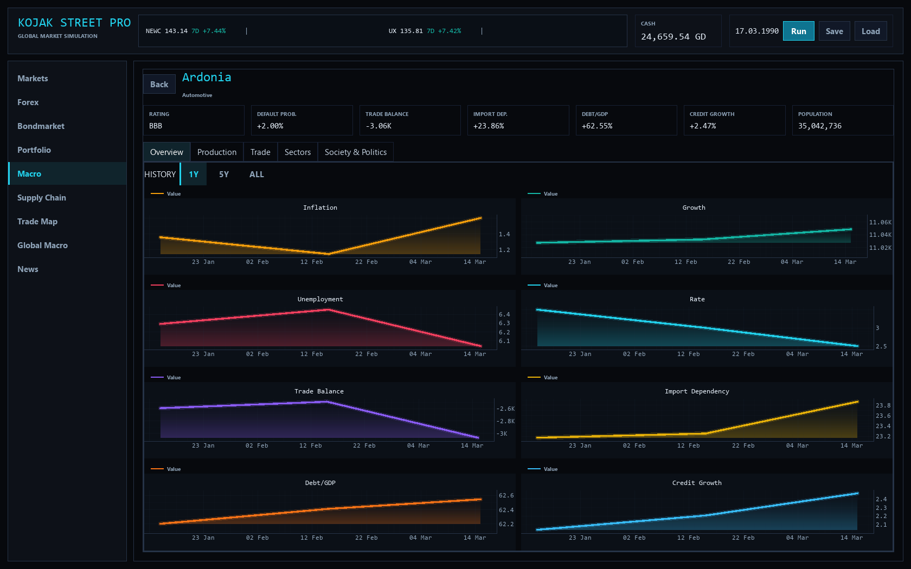
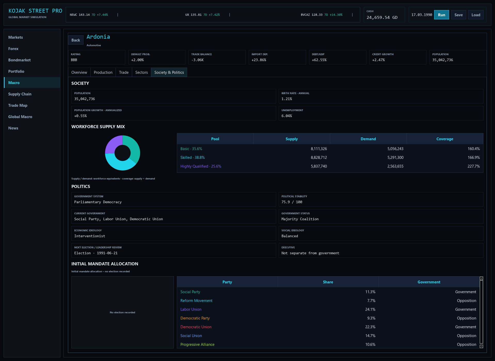

# Society & Politics — capture record

The 7 October implementation audit captured nine targeted regime/mandate fixtures,
the previous four country tabs, and multiple viewport/scroll positions. Those
full diagnostic sets remain local evidence rather than portfolio screenshots.
Fixture dates and the surrounding shell date were not always identical; they
must not be presented as ordinary gameplay outcomes.

For publication, the following selected captures replace private local image
links. They show the current application in a real Heterogeneous World, seed
1729, on 17 March 1990 after 75 actual daily steps. Ardonia has an initial mandate
allocation; no election has yet been recorded there. Observed population growth
and country history come from the real reporting pipeline.

The other selected images and reproduction conditions are listed in the
[closeout verification record](portfolio-closeout-2026-10-08.md).
